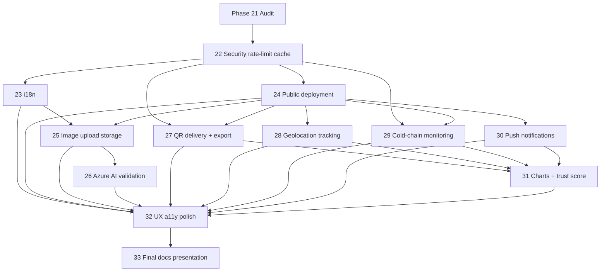

# Enhancement Planning — Phase 21 Audit Companion

**Status:** Phase 21 planning companion; stack rows for rate limiting / cache / Helmet / GraphQL limits updated after Phase 22 implementation.  
**Evidence date:** 2026-07-23 · Phase 22 security foundation on `develop` (uncommitted until requested)  
**Companion docs:** [requirements-matrix.md](./requirements-matrix.md) · [implementation-roadmap.md](./implementation-roadmap.md) · [enhancement-domain-model.md](./enhancement-domain-model.md)

**Source hierarchy (conflicts documented explicitly):**

1. Original assignment / checklists / project fiche (`description.md`, `project-fiche.md`)
2. Current `examMaciej` implementation
3. Current `examMaciej` documentation
4. Teacher demo patterns (`bearspray-2025-demo`, read-only)
5. Prior roadmap assumptions

---

## 1. Technology-stack compliance audit

| Technology                  | Required / expected / optional                                                                          | Repository evidence                              | Status         | Limitations                                                                       | Replacement / addition needed?                   |
| --------------------------- | ------------------------------------------------------------------------------------------------------- | ------------------------------------------------ | -------------- | --------------------------------------------------------------------------------- | ------------------------------------------------ |
| npm workspaces              | Strongly expected                                                                                       | Root `package.json` `workspaces: ["packages/*"]` | Implemented    | —                                                                                 | No; Lerna not required                           |
| Vue 3                       | Mandatory                                                                                               | `packages/pwa` `vue` ^3.5                        | Implemented    | —                                                                                 | No                                               |
| TypeScript                  | Mandatory                                                                                               | API/PWA/types `typescript`                       | Implemented    | Strict mode in API/PWA                                                            | No                                               |
| Composition API             | Mandatory                                                                                               | `<script setup>` SFCs; no Options API found      | Implemented    | —                                                                                 | No                                               |
| Vite                        | Strongly expected                                                                                       | `packages/pwa/vite.config.ts`, Vite ^6           | Implemented    | —                                                                                 | No                                               |
| Tailwind / Nuxt UI          | Mandatory (Tailwind/Uno)                                                                                | `@nuxt/ui` Vite plugin (Tailwind via kit)        | Implemented    | Few hand-written utilities may exist                                              | Prefer Nuxt UI; polish in Phase 32               |
| Vue Router                  | Strongly expected                                                                                       | `packages/pwa/src/router/index.ts`               | Implemented    | —                                                                                 | No                                               |
| Apollo Client               | Strongly expected                                                                                       | `@apollo/client`, `useGraphQL.ts`                | Implemented    | —                                                                                 | No                                               |
| NestJS                      | Mandatory                                                                                               | `packages/api` Nest 11                           | Implemented    | —                                                                                 | No                                               |
| Code-first GraphQL          | Mandatory                                                                                               | `GraphQLModule` `autoSchemaFile`                 | Implemented    | Schema gitignored; generate on demand                                             | No                                               |
| MongoDB                     | Mandatory                                                                                               | TypeORM `type: 'mongodb'`; Compose `mongo:7`     | Implemented    | Single-node; no multi-doc TX                                                      | No                                               |
| TypeORM                     | Strongly expected                                                                                       | `typeorm` + Mongo driver                         | Implemented    | `synchronize` in non-prod                                                         | Justify migrations later if needed               |
| Firebase client auth        | Mandatory                                                                                               | PWA `firebase` + `useFirebase.ts`                | Implemented    | Email/password only; PKCE not used by this flow (AUTH-002 ambiguous vs checklist) | Do not claim PKCE via Firebase alone             |
| Firebase Admin verification | Strongly expected                                                                                       | `firebase-admin`, `AuthorizationGuard`           | Implemented    | Service account via mount/env                                                     | No                                               |
| GraphQL subscriptions       | Mandatory                                                                                               | `@Subscription` + PubSub                         | Implemented    | In-memory PubSub only                                                             | Redis PubSub if multi-instance deploy (Phase 24) |
| graphql-ws                  | Strongly expected                                                                                       | API + PWA deps; WS `onConnect`                   | Implemented    | —                                                                                 | No                                               |
| GraphQL Code Generator      | Strongly expected                                                                                       | `@vaccin-delivery/types`                         | Implemented    | —                                                                                 | No                                               |
| Jest                        | Mandatory (API tests)                                                                                   | API Jest + many `*.spec.ts`                      | Implemented    | —                                                                                 | No                                               |
| Vitest                      | Optional (extra)                                                                                        | PWA Vitest + several specs                       | Implemented    | Coverage not exhaustive                                                           | Expand in later phases as needed                 |
| Playwright                  | Mandatory (≥1 integration)                                                                              | Root `tests/*.spec.ts`, CI workflow              | Implemented    | Chromium-only                                                                     | Extend for new flows                             |
| Docker                      | Mandatory                                                                                               | API/PWA Dockerfiles + Compose                    | Implemented    | Local/presentation only                                                           | Public deploy Phase 24                           |
| nginx                       | Strongly expected                                                                                       | `packages/pwa/nginx.conf`                        | Implemented    | Headers on PWA                                                                    | API also has Helmet (Phase 22)                   |
| GitHub Actions              | Mandatory                                                                                               | 5 workflows, green @ HEAD                        | Implemented    | No deploy job yet                                                                 | Deploy workflow Phase 24                         |
| Husky / lint-staged         | Optional                                                                                                | `.husky/*`, root lint-staged                     | Implemented    | —                                                                                 | No                                               |
| PWA / service worker        | Mandatory                                                                                               | `vite-plugin-pwa`, offline.html                  | Implemented    | No push; no auth GraphQL cache                                                    | Push Phase 30                                    |
| Rate limiting               | Optional or extra in original checklist; mandatory for this project’s chosen Tier A final scope         | `@nestjs/throttler` + Graphql/Strict guards      | Implemented    | Global often IP; identity after auth; process-local                               | Maintain; Redis optional later                   |
| Response / memory caching   | Optional or extra in original checklist; mandatory for this project’s chosen Tier A final scope         | `cache-manager` v7 + settings/vaccines keys      | Implemented    | Process-local only; three keys                                                    | Redis if multi-instance                          |
| Runtime i18n                | Optional or extra in original checklist; mandatory for this project’s chosen Tier A final scope         | No `vue-i18n`                                    | Missing        | Manifest `lang: 'nl'` only                                                        | Phase 23                                         |
| PKCE                        | Checklist line; applicability unresolved for Firebase email/password                                    | Not implemented                                  | Ambiguous      | Do not claim Firebase email/password uses PKCE                                    | Clarify with teacher; do not fake PKCE           |
| GraphQL complexity/depth    | Quality / security                                                                                      | Custom depth rule + complexity Apollo plugin     | Implemented    | Default max complexity 500; introspection skipped                                 | Maintain                                         |
| Helmet / CSP (API)          | CSRF/XSS checklist                                                                                      | `helmet` via `configureApiApp`                   | Implemented    | Env-aware CSP for GraphiQL in non-prod only                                       | Maintain                                         |
| External public deployment  | Optional or extra (bonus) in original checklist; mandatory for this project’s chosen Tier A final scope | Compose only; CI build no push                   | Missing        | —                                                                                 | Phase 24                                         |
| Lerna                       | Optional                                                                                                | Absent (workspaces scripts)                      | Not applicable | —                                                                                 | Do not add                                       |

---

## 2. Mandatory-gap classification

### P0 — must resolve before final submission

| Gap                                                   | Requirement IDs              | Evidence                                             | Target phase | Notes                                                                                               |
| ----------------------------------------------------- | ---------------------------- | ---------------------------------------------------- | ------------ | --------------------------------------------------------------------------------------------------- |
| Public deployment of API + PWA + Mongo + WS           | DEVOPS-007, PRESENT-003 path | No public host; Compose local only                   | 24           | Optional or extra in the original checklist; mandatory for this project’s chosen Tier A final scope |
| Runtime i18n NL/EN with teacher-style workflow        | FRONT-018                    | No vue-i18n / Sheets exporter                        | 23           | Optional or extra in the original checklist; mandatory for this project’s chosen Tier A final scope |
| Backend rate limiting                                 | description extras           | `@nestjs/throttler` Phase 22                         | done (22)    | Optional or extra in the original checklist; mandatory for this project’s chosen Tier A final scope |
| Caching + invalidation                                | description extras           | settings/vaccines process-local cache Phase 22       | done (22)    | Optional or extra in the original checklist; mandatory for this project’s chosen Tier A final scope |
| CSRF/XSS threat-model documentation + headers         | API-012                      | Helmet + README SPA+Bearer model                     | done (22)    | Maintain; expand in Phase 33 dossier freeze if needed                                               |
| Submission docs freeze (checklists, Toggle, Leho ZIP) | DOC-007, DOC-008, SUBMIT-*   | README strong; final checklist attachments still due | 33           | Not blocking Phase 23 coding                                                                        |
| Oral/presentation readiness                           | PRESENT-*                    | Feature-complete enough for demo; rehearsal deferred | 33           | After enhancements stabilize                                                                        |

### P1 — strongly recommended for marks

| Gap                                             | IDs              | Evidence                                      | Target phase                   |
| ----------------------------------------------- | ---------------- | --------------------------------------------- | ------------------------------ |
| GraphQL query complexity / depth limits         | API-012 adjacent | Implemented Phase 22                          | done (22)                      |
| Accessibility evidence (audit + fixes)          | FRONT-026        | Nuxt UI baseline; no axe/audit artifacts      | 32                             |
| Loading/skeleton consistency across all screens | FRONT-019        | CommonLoadingSkeleton exists; coverage uneven | 32                             |
| Documented CSRF/XSS engineering controls        | API-012          | Implemented Phase 22 (README + Helmet)        | done (22); dossier freeze 33   |
| Production realtime under multi-instance        | API-015/017      | In-memory PubSub                              | 24 (if multi-node)             |
| Seed-at-start wording clarification             | DATA-008         | CLI seed chosen deliberately                  | Clarify / document (teacher Q) |

### P2 — optional differentiators

| Gap                                                | Target phase | Defer if time-constrained?    |
| -------------------------------------------------- | ------------ | ----------------------------- |
| Vaccine image upload + blob storage                | 25           | Defer to Tier B fallback      |
| Azure AI image validation                          | 26           | Yes — mock/manual review only |
| QR proof of delivery + manifest export             | 27           | Partial: QR without PDF OK    |
| Courier geolocation + role map                     | 28           | Yes                           |
| Cold-chain temperature (SIMULATED/MANUAL/BLE/MQTT) | 29           | Simulated-only MVP if started |
| PWA push notifications                             | 30           | Yes                           |
| ADMIN charts + trust score                         | 31           | Charts without trust OK       |
| Hardware MQTT broker                               | 29 optional  | Yes                           |
| Sentry/LogRocket/K8s/Docker Hub                    | —            | Defer indefinitely            |

### Conflicts requiring explicit choice

| Conflict                                         | Higher authority                | Chosen interpretation                                                                                                                                         | Teacher clarification?        |
| ------------------------------------------------ | ------------------------------- | ------------------------------------------------------------------------------------------------------------------------------------------------------------- | ----------------------------- |
| L82 “seeder … bij opstarten” vs safe Docker      | Architecture + DATA-008c        | **Idempotent CLI seed**; not destructive boot seed                                                                                                            | Optional — confirm acceptable |
| Checklist “PKCE flow” vs Firebase email/password | Architecture ADR-007 + AUTH-002 | **Ambiguous** — do not claim implemented or that Firebase email/password uses PKCE; operational default until clarified: not required for email/password-only | Recommended                   |
| External host “bonus” vs Tier A plan             | Student roadmap decision        | Optional or extra in the original checklist; mandatory for this project’s chosen Tier A final scope                                                           | No (self-imposed bar)         |
| Rate limit/cache “extra” vs Tier A               | Same                            | Optional or extra in the original checklist; mandatory for this project’s chosen Tier A final scope (Phase 22)                                                | No                            |
| i18n “meerwaarde” vs Tier A                      | Same                            | Optional or extra in the original checklist; mandatory for this project’s chosen Tier A final scope (Phase 23)                                                | No                            |

---

## 3. Feature dependency map

**Minimum dependency rules:**

- i18n (23) before major new UI string expansion (25–32)
- Deployment (24) before cloud media integration (25), production geolocation (28), web push (30), and preferred before QR/cold-chain public demos (27/29)
- Image storage (25) before AI validation (26)
- QR delivery (27) before reliable trust metrics (31)
- Tracking (28) before pharmacy location-based visibility
- Temperature readings (29) before cold-chain analytics / trust inputs
- Push (30) after meaningful event sources (orders/routes/incidents) and public HTTPS (24)
- Trust score (31) after delivery/QR/tracking/incident/push data exist when those phases ship
- Charts (31) after stable aggregates (may omit trust if Tier C deferred)
- Final UX polish (32) after i18n (23) and public deployment (24); polish only optional feature screens that actually shipped
- Final docs/presentation (33) after Phase 32 (Tier A path `21 → 22 → 23 → 24 → 32 → 33`); **does not require deferred Tier B/C**

---

## 4. GraphQL impact proposal (candidates only)

Planning candidates — not fixed contracts until the owning phase.

### Queries

| Candidate                      | Roles            | Ownership                                 | Sensitivity     | Phase |
| ------------------------------ | ---------------- | ----------------------------------------- | --------------- | ----- |
| `adminDashboardMetrics`        | ADMIN            | Global aggregates                         | Medium (ops)    | 31    |
| `courierLocations`             | ADMIN            | All active couriers                       | High (location) | 28    |
| `relevantCourierForMyPharmacy` | APOTHEKER        | Approaching courier for own pharmacy only | High            | 28    |
| `deliveryManifest`             | ADMIN / BEZORGER | Route-scoped                              | Medium          | 27    |
| `courierReliability`           | ADMIN            | Per-courier score                         | Medium          | 31    |
| `vaccineImageAnalysisStatus`   | ADMIN            | Per vaccine / media                       | Low–medium      | 26    |

### Mutations

| Candidate                       | Roles                | Ownership                  | Sensitivity     | Phase |
| ------------------------------- | -------------------- | -------------------------- | --------------- | ----- |
| Upload / attach vaccine image   | ADMIN                | Vaccine ownership          | Medium          | 25    |
| Request / retry image analysis  | ADMIN                | Linked media               | Medium          | 26    |
| Override image decision         | ADMIN                | Audit reason required      | Medium          | 26    |
| Issue delivery QR               | BEZORGER / ADMIN     | Active stop / order        | High            | 27    |
| Verify delivery QR              | BEZORGER / APOTHEKER | Matching parties           | High            | 27    |
| Submit location                 | BEZORGER             | Own profile + active route | High            | 28    |
| Submit temperature reading      | BEZORGER / system    | Route / device scoped      | Medium          | 29    |
| Acknowledge cold-chain incident | ADMIN / BEZORGER     | Assigned scope             | Medium          | 29    |
| Register push subscription      | Authenticated        | Own user                   | High (endpoint) | 30    |
| Update notification preferences | Authenticated        | Own user                   | Low             | 30    |

### Subscriptions

| Candidate                     | Roles             | Filter                 | Sensitivity | Phase                                   |
| ----------------------------- | ----------------- | ---------------------- | ----------- | --------------------------------------- |
| `courierLocationUpdated`      | ADMIN / APOTHEKER | Role-scoped            | High        | 28                                      |
| `coldChainIncidentCreated`    | ADMIN / BEZORGER  | Route / role           | Medium      | 29                                      |
| `routeAssignmentUpdated`      | BEZORGER / ADMIN  | Existing route filters | Medium      | 28 (extend)                             |
| `vaccineImageAnalysisUpdated` | ADMIN             | Vaccine id             | Low         | 26                                      |
| `notificationCreated`         | Existing          | Recipient filter       | Medium      | Already present; extend for push bridge |

---

## 5. External-service inventory

| Service                   | Purpose                | Mandatory / optional | Likely provider                                            | Local substitute               | Secrets                         | Cost risk | Lock-in | Outage behavior                    | Phase    |
| ------------------------- | ---------------------- | -------------------- | ---------------------------------------------------------- | ------------------------------ | ------------------------------- | --------- | ------- | ---------------------------------- | -------- |
| Frontend hosting          | Public PWA             | Tier A               | Azure Static Web Apps / Netlify / Cloudflare Pages         | Vite preview / nginx container | Build-time `VITE_*`             | Low       | Low–med | Stale UI if CDN down               | 24       |
| API / container hosting   | Public GraphQL + WS    | Tier A               | Azure Container Apps / Railway / Fly.io / VPS              | Local Compose                  | Firebase SA, DB URL             | Med       | Med     | API unavailable                    | 24       |
| MongoDB Atlas (or equiv.) | Persistent DB          | Tier A               | Atlas free/shared                                          | Docker `mongo:7`               | Connection string               | Low–med   | Med     | Read/write fail                    | 24       |
| Azure Blob Storage        | Vaccine images         | Tier B               | Azure Blob                                                 | Local disk / Azurite           | Connection string / SAS         | Low       | Med     | Upload fail; keep metadata         | 25       |
| Azure AI / Foundry vision | Image validation       | Tier B               | Azure OpenAI / Vision                                      | Mock classifier                | API key / endpoint              | Med–high  | High    | Manual review fallback             | 26       |
| Map provider              | Courier map            | Tier C               | MapLibre + OSM tiles (prefer over Mapbox unless justified) | Static list UI                 | Optional token                  | Low       | Low     | Map blank; list remains            | 28       |
| Web Push (VAPID)          | Push notifications     | Tier C               | Browser Push API + own VAPID keys                          | Console log stub               | VAPID private key               | Low       | Low     | In-app notifications only          | 30       |
| MQTT broker               | Optional hardware temp | Tier C               | HiveMQ Cloud / Mosquitto                                   | SIMULATED / MANUAL sources     | Broker creds                    | Low       | Med     | Fall back to MANUAL                | 29       |
| PDF/CSV export            | Manifest export        | Tier B               | Server-side lib (e.g. pdfkit)                              | CSV-only                       | None                            | Low       | Low     | Export endpoint 503                | 27       |
| Translation workflow      | Sheets → JSON          | Tier A               | Google Sheets + OAuth desktop client (teacher pattern)     | Hand-edited locale JSON        | `credentials.json` (gitignored) | Low       | Low     | Stale translations; ship last JSON | 23       |
| Firebase Auth             | Identity               | Already mandatory    | Firebase                                                   | Emulator (optional later)      | Admin SA                        | Low       | Med     | Login fails                        | Existing |

Providers are **not** locked unless course/repo evidence already forces a choice (Firebase is locked).

---

## 6. Deployment strategy comparison

| Criterion                | A — Azure-first                             | B — Mixed student-friendly managed | C — Single VPS / single-node Compose |
| ------------------------ | ------------------------------------------- | ---------------------------------- | ------------------------------------ |
| Cost                     | Student credits if available; else moderate | Often free tiers                   | Low VPS monthly                      |
| Student credits          | Best fit if Azure for Students              | Partial                            | None                                 |
| Setup complexity         | Medium–high                                 | Medium                             | Low–medium                           |
| Docker support           | Container Apps / ACI                        | Railway/Fly/Render good            | Native Docker Compose                |
| WebSocket support        | Needs explicit config                       | Usually OK                         | Native                               |
| Custom domains           | Good                                        | Good                               | Good                                 |
| Secret handling          | Key Vault / app settings                    | Platform secrets                   | `.env` on host (discipline required) |
| MongoDB                  | Atlas paired                                | Atlas paired                       | Local Mongo on VPS or Atlas          |
| Azure AI integration     | Best colocation                             | Cross-cloud OK                     | OK via HTTPS                         |
| CI deployment            | GitHub → Azure                              | GitHub → platform                  | GitHub → SSH/compose                 |
| Rollback                 | Revision swap                               | Redeploy previous image            | Previous compose tag                 |
| Presentation reliability | High if rehearsed                           | High                               | Depends on VPS uptime                |

**Primary recommendation:** **B — mixed managed hosting** (container platform for API + static/PWA host + MongoDB Atlas), with Azure AI/Blob only when Phases 25–26 start.  
**Fallback:** **C — single VPS running production Compose** if managed WS/CORS friction blocks Phase 24.  
**Azure-first (A)** remains attractive if student credits cover Container Apps + Blob + AI together.

Do **not** deploy in Phase 21.

---

## 7. i18n planning (teacher-aligned)

### Teacher demo evidence (patterns only — do not copy source)

| Aspect           | Teacher pattern                                                                  |
| ---------------- | -------------------------------------------------------------------------------- |
| Exporter package | `packages/i18n` with Sheets reader (`sheet.ts` / README `sheets.ts`)             |
| Auth to Sheets   | Google OAuth Desktop client → `credentials.json` under i18n package (gitignored) |
| Output           | Generated locale JSON (`en`, `nl`, `zh`, `es` in demo)                           |
| Runtime          | `vue-i18n` + `useLanguage` composable loading `@/assets/locales/{locale}.json`   |
| Outside Cursor   | Creating Google Cloud OAuth client, Sheets access, running exporter CLI          |

### Planned exam approach (Phase 23)

| Item            | Plan                                                                                      |
| --------------- | ----------------------------------------------------------------------------------------- |
| Locales         | **nl** (default), **en** (runtime fallback), **zh**, **es**                               |
| Runtime         | `vue-i18n` Composition API + `useLanguage` + `CommonLanguageSelector` _(23B done)_        |
| Source of truth | Google Sheet (editable) → exporter → committed locale JSON (runtime/CI); no Google in PWA |
| Generated files | `packages/pwa/src/locales/{nl,en,zh,es}.json`                                             |
| Exporter        | `packages/i18n-export` workspace (student-owned; Phase 23A implemented)                   |
| Persistence     | `localStorage['vaccin-delivery:locale']`                                                  |
| Missing keys    | Runtime → English catalog; export-time → Sheet Default (separate) _(23B)_                 |
| Tests           | Exporter offline (23A); resolution/loader/`setLocale`; Playwright language-switch (23B)   |
| Remaining       | Full UI string + date/number migration → **Phase 23C**                                    |
| Sync note       | Edit Sheet in Google UI, then `npm run export:i18n` (readonly; no offline merge)          |

### External / manual student steps (not done by agent in Phase 23 alone)

1. Create Google Cloud project OAuth client (Desktop App).
2. Save credentials outside Git (path documented in README).
3. Create / copy translation spreadsheet with `nl` and `en` tabs.
4. Share sheet with the Google account used for export.
5. Run exporter CLI; commit generated JSON.
6. Verify CI does not require live Sheets access (uses committed JSON).

---

## 8. Feature priority and fallback tiers

### Tier A — final submission bar for this project

Rate limiting, caching, runtime i18n, and public deployment below are optional or extra in the original checklist; mandatory for this project’s chosen Tier A final scope.

| Feature                                    | Impl complexity | Test complexity | Ext. dependency risk | Demo value | Rubric value | Fallback if incomplete                         |
| ------------------------------------------ | --------------- | --------------- | -------------------- | ---------- | ------------ | ---------------------------------------------- |
| Requirements compliance docs               | low             | low             | low                  | medium     | high         | N/A (this phase)                               |
| Rate limiting + caching + security headers | medium          | medium          | low                  | medium     | high         | Document gap; minimal throttler only           |
| Runtime i18n NL/EN                         | medium          | medium          | medium (Sheets)      | high       | high         | Hand-maintained JSON only                      |
| Public deployment                          | high            | medium          | high                 | very high  | high         | Local Docker demo + recorded URL attempt notes |
| Stable existing functionality              | —               | —               | —                    | very high  | very high    | Freeze regressions                             |
| Final docs / presentation                  | medium          | low             | low                  | high       | very high    | Shorter dossier                                |

### Tier B — high-value enhancements

| Feature                   | Impl      | Test   | Ext risk | Demo      | Rubric | Fallback                         |
| ------------------------- | --------- | ------ | -------- | --------- | ------ | -------------------------------- |
| Image upload + storage    | high      | medium | medium   | high      | high   | Skip AI; URL placeholder         |
| Azure AI image validation | very high | high   | high     | very high | high   | Manual review only               |
| QR proof of delivery      | high      | high   | low      | very high | high   | Manual mark delivered (existing) |
| Manifest PDF/CSV export   | medium    | medium | low      | medium    | medium | CSV only                         |
| ADMIN charts              | medium    | medium | low      | high      | medium | Tables without charts            |

### Tier C — distinction features

| Feature                   | Impl      | Test | Ext risk        | Demo      | Rubric | Fallback                           |
| ------------------------- | --------- | ---- | --------------- | --------- | ------ | ---------------------------------- |
| Courier tracking + maps   | very high | high | medium          | very high | medium | Admin list timestamps only         |
| Cold-chain monitoring     | very high | high | high (hardware) | very high | high   | SIMULATED source only; no BLE/MQTT |
| Push notifications        | high      | high | medium          | high      | medium | In-app notifications only          |
| Trust / reliability score | high      | high | low             | high      | medium | Omit formula; show raw metrics     |
| Hardware MQTT             | very high | high | high            | high      | high   | SIMULATED / MANUAL                 |

**Temperature feasibility constraint:** a normal PWA must **not** claim phone ambient sensors as vaccine cargo temperature. Supported source model: `SIMULATED` | `MANUAL` | `BLE_SENSOR` | `MQTT_DEVICE`.

---

## 9. Testing roadmap (by future phase)

| Phase | Expected tests                                                                                                                                    |
| ----- | ------------------------------------------------------------------------------------------------------------------------------------------------- |
| 22    | Unit: throttle keying, cache keys/TTL/invalidation; API E2E: throttled ops return limit errors; security header smoke; complexity/depth rejection |
| 23    | Missing-key safety; locale switch unit; Playwright language-switch flow; snapshot of critical strings                                             |
| 24    | Public `/health` checks; WebSocket smoke; Firebase login smoke; production PWA installability; CORS origin checks                                 |
| 25    | Upload validation (type/size); authz; replace/delete; catalogue display; blob failure handling                                                    |
| 26    | Mocked Azure responses; retry/timeout/circuit breaker; override audit; cache-by-hash; authz                                                       |
| 27    | QR signature/expiry/nonce/replay; wrong courier/pharmacy; idempotent confirm; CSV/PDF export authz                                                |
| 28    | Role-scoped visibility; stale location; route relationship; retention job; subscription filters                                                   |
| 29    | Thresholds; excursion duration; incident lifecycle; ack; multi-vaccine route; source enum validation                                              |
| 30    | Subscription lifecycle; invalid endpoint cleanup; safe payloads (no sensitive overshare); permission UX                                           |
| 31    | Aggregate query correctness; chart data contract; trust formula determinism; min sample size; snapshots                                           |
| 32    | a11y checks (keyboard/aria); loading/empty/error states; responsive Playwright smoke                                                              |
| 33    | Doc link checks; clone-to-run rehearsal notes; checklist completeness (manual)                                                                    |

---

## 10. Security and privacy roadmap

| Area                 | Future controls (engineering)                                                      | Risks                                         |
| -------------------- | ---------------------------------------------------------------------------------- | --------------------------------------------- |
| Image upload         | MIME/size limits; virus scan optional; authz ADMIN; signed upload URLs short-lived | Malicious file, storage cost                  |
| AI secrets           | Server-only keys; never `VITE_`; timeout/circuit breaker                           | Key leak, prompt injection via image metadata |
| QR tokens            | Signed/opaque; expiry; nonce; single-use or idempotent confirm                     | Replay, QR screenshot sharing                 |
| Location privacy     | Role filters; retention TTL; no historical trail beyond policy                     | Stalking risk, GDPR minimization              |
| Temperature / device | Device id pseudonymous; source enum; no phone-as-sensor claim                      | False confidence in cold chain                |
| Push endpoints       | Encrypt at rest if possible; cleanup on 410; role-safe payloads                    | Endpoint leakage                              |
| Analytics / trust    | Role-scoped; transparent formula; auditable inputs                                 | Discriminatory scoring perception             |
| Auditability         | Append-only audit for overrides, QR verify, stock, AI override                     | Incomplete audit trails                       |
| Data minimization    | Retain only fields needed for demo + safety                                        | Over-collection                               |

No legal compliance claims are made; controls are engineering risk reductions.

---

## 11. Current implementation snapshot (evidence)

| Area           | Status                                                                                                         |
| -------------- | -------------------------------------------------------------------------------------------------------------- |
| Domain modules | Auth, users, profiles, settings, vaccines, stock, orders, route-templates, routes, notifications, health, seed |
| Frontend       | Auth + apotheker + admin + bezorger flows with loading/empty/error components                                  |
| Realtime       | Filtered subscriptions; WS auth; in-memory PubSub                                                              |
| PWA            | Installable; offline fallback; update prompt; static precache only                                             |
| Docker         | Dev Mongo + production full stack; safety tests                                                                |
| CI             | 5 green workflows @ `f3e4d07`                                                                                  |
| Seed           | Idempotent CLI; gated; Firebase provisioning; demo accounts incl. `docent@howest.be`                           |

---

## 12. Unresolved teacher questions

1. Is **CLI idempotent seed** (not auto-seed on every boot) acceptable for “seeder bij opstarten”?
2. Is **PKCE** required when using **Firebase email/password** only?
3. Preferred public host constraints (must be Azure)?
4. Is Google Sheets i18n workflow **required** for i18n bonus, or is committed JSON + vue-i18n enough?
5. Any prohibition on **location tracking** / **push** for exam demos?

---

_Document version: 2026-07-23 (Phase 21)._
