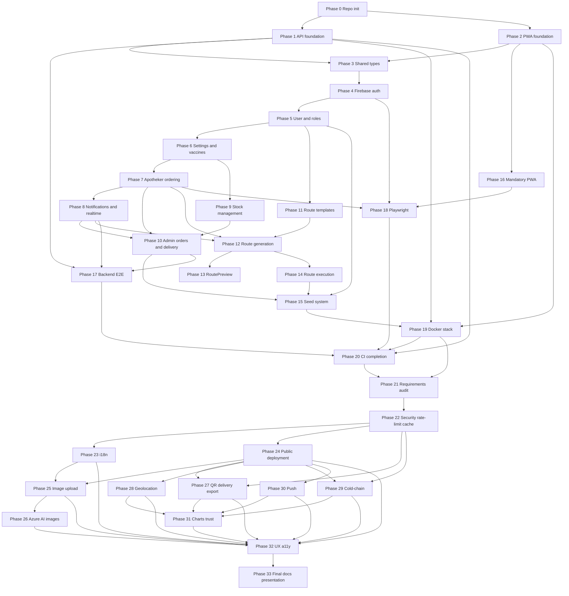

# Implementation Roadmap — Vaccinatie-levering

Incremental build sequence for the exam project in `examMaciej/` (historical docs may say `examAfsdMaciejMitura/`). The [architecture document](./project-architecture.md) describes the **core end state** through Phase 20; [enhancement-planning.md](./enhancement-planning.md) and phases **21–33** describe the post-MVP enhancement path.

**Reference:** `bearspray-2025-demo` @ `ad691e3` — **patterns only**, never copy source.

**Target repository:** `examMaciej/` (Git root).

---

## How to use this roadmap

1. Complete phases in order unless a dependency graph exception is documented.
2. Do **not** skip stop-condition checks at phase boundaries.
3. Run listed commands locally before marking a phase complete.
4. Commit after each phase with the recommended message.
5. After Phase 21, follow enhancement phases **22–33** in [enhancement-planning.md](./enhancement-planning.md). Do not start a later enhancement phase until its prerequisites are met. Tier C items may be deferred if time-constrained.

---

## Global stop conditions

Stop and resolve before starting the next phase when any of the following occur:

| Condition                                                 | Action                                                      |
| --------------------------------------------------------- | ----------------------------------------------------------- |
| Typecheck fails (`tsc`, `vue-tsc`)                        | Fix types; do not proceed                                   |
| Lint fails                                                | Fix or explicitly defer with documented exception           |
| Required tests fail                                       | Fix tests or implementation — no “skip for now”             |
| Architecture conflict with `project-architecture.md`      | Update architecture doc first (student approval), then code |
| Authorization unresolved (public mutation, missing guard) | Block phase completion                                      |
| Data loss risk (destructive seed, drop database)          | Document and gate behind explicit command                   |
| Generated types stale (`generate:graphql` not run)        | Regenerate before PWA/API integration                       |
| App cannot start cleanly                                  | Diagnose env, MongoDB, Firebase, ports                      |
| Teacher demo source copied into repo                      | Remove and re-implement from patterns only                  |

---

## Dependency graph



Full enhancement dependency narrative: [enhancement-planning.md §3](./enhancement-planning.md).

---

## Critical path

### Tier A (mandatory final bar for this project)

`… → 20 → 21 → 22 → 23 → 24 → 32 → 33`

Phases **0–20** are complete on `develop` @ `f3e4d07`. Phase 21 is documentation/audit only. Rate limiting, caching, i18n, and public deployment are optional or extra in the original checklist; mandatory for this project’s chosen Tier A final scope.

### Tier B (high-value enhancements — deferrable)

`23+24 → 25 → 26`, and `22+24 → 27`, plus charts portion of `31` — after Tier A foundations; Phase 24 strongly preferred before cloud media and public demos. Tier B is not required for Phase 33.

### Tier C (distinction — deferrable)

`24 → 28|29|30 → 31` (trust inputs), hardware MQTT — only if time remains. Phase 33 does **not** require deferred Tier C features.

---

# Phase 0 — Repository initialization

## Phase metadata

| Field                     | Value                                                                                                        |
| ------------------------- | ------------------------------------------------------------------------------------------------------------ |
| **Phase**                 | 0 — Repository initialization                                                                                |
| **Objective**             | Create an empty, correctly structured monorepo skeleton with Git and tooling — no application frameworks yet |
| **Architecture sections** | §2, §3, §3.1, ADR-001, ADR-018                                                                               |
| **Requirement IDs**       | ARCH-001, ARCH-007, ARCH-010, QUALITY-002, QUALITY-005, SUBMIT-001                                           |
| **Prerequisites**         | Approved architecture and this roadmap; empty `examAfsdMaciejMitura/` directory                              |

### Explicit scope

- Initialize Git in `examAfsdMaciejMitura/`
- Root `package.json` with npm workspaces: `packages/*`
- Package boundary folders: `packages/api`, `packages/pwa`, `packages/types` (minimal `package.json` name stubs only)
- `.gitignore` (node_modules, dist, .env, Firebase SA, generated artifacts per ADR-018)
- `.nvmrc` (e.g. `v24.8.0`)
- Prettier config (root)
- Root scripts: placeholders for `dev`, `build`, `lint` (may noop until Phase 1–2)
- Copy **approved** project docs into repo `docs/` (architecture, roadmap, fiche — not teacher demo)
- Initial `README.md` placeholder (setup TBD)
- `.github/ISSUE_TEMPLATE/hulp-docent.md` optional stub

### Explicit out-of-scope

- NestJS, Vue, Docker, Firebase, domain code, lockfile generation via `npm install` in this session (student/agent runs install once scaffold exists)
- Copying any file from `bearspray-2025-demo/`
- `AGENTS.md` (separate step before Phase 1 feature work — see Final decision)

### Expected files or modules

```
examAfsdMaciejMitura/
├── .git/
├── .gitignore
├── .nvmrc
├── .prettierrc.json
├── package.json
├── README.md
├── docs/          (copied approved docs)
├── packages/
│   ├── api/package.json      (@vaccin-delivery/api stub)
│   ├── pwa/package.json      (@vaccin-delivery/pwa stub)
│   └── types/package.json    (@vaccin-delivery/types stub)
```

### Dependencies that may be added

- None in package stubs beyond name/version/private fields (full install in Phase 1–2)

### Configuration or environment changes

- None

### Database/schema changes

- None

### GraphQL changes

- None

### Frontend changes

- None

### Authorization implications

- None

### Realtime implications

- None

### Tests required

- None (structure-only phase)

### Commands to run

```bash
cd examAfsdMaciejMitura
git init
git add .
git commit -m "chore: initialize monorepo skeleton"
# After student adds lockfile in Phase 1:
# npm install  (from root — verifies workspaces resolve)
```

### Manual acceptance checklist

- [ ] Single lockfile strategy documented in README (npm `package-lock.json` only)
- [ ] No `bearspray-2025-demo/` or Bear Spray entities in repository
- [ ] `npm pkg get workspaces` resolves `packages/*`
- [ ] `.gitignore` excludes `packages/api/dist/`, `packages/types/dist/`, `.env`, `*firebase*sa*.json`
- [ ] First clean Git commit exists
- [ ] Teacher source absent from repository

### Common failure modes

- Duplicate lockfiles (bun + npm)
- Workspace paths typo (`package` vs `packages`)
- Accidentally committing workspace parent research repo files

### Completion evidence

- `git log -1` shows init commit; directory tree matches expected layout

### Recommended Git commit message

```
chore: initialize vaccin-delivery monorepo skeleton
```

### Oral-exam concepts to understand

- Why npm workspaces vs separate repos
- What belongs in exam repo vs parent workspace docs

### Runnable state

**Not runnable** as an application — intentional. Repository structure only.

---

# Phase 1 — NestJS API foundation

## Phase metadata

| Field                     | Value                                                                                                                               |
| ------------------------- | ----------------------------------------------------------------------------------------------------------------------------------- |
| **Phase**                 | 1 — NestJS API foundation                                                                                                           |
| **Objective**             | Bootstrapped NestJS API with GraphQL, MongoDB, health check, and CI phase 1                                                         |
| **Architecture sections** | §2, §3, §4 (skeleton), §16.1                                                                                                        |
| **Requirement IDs**       | API-001, API-002, API-003, API-005, API-008, API-009, API-011, DATA-001, DATA-002, DATA-003, DATA-005, TEST-001, TEST-006 (phase 1) |
| **Prerequisites**         | Phase 0 complete; MongoDB available locally or via future dev Compose (may use local install for this phase)                        |

### Explicit scope

- NestJS scaffold inside `packages/api` (`@vaccin-delivery/api`)
- Code-first GraphQL + GraphiQL
- Global `ValidationPipe`, CORS from env
- Config module + `packages/api/.env.example`
- TypeORM MongoDB connection (`synchronize: true` in dev)
- Health: REST `GET /health` and/or GraphQL `health` query
- `AppModule` only — no domain modules
- ESLint, Jest, `npm run test`, `npm run lint`, `npm run build`
- `.github/workflows/ci-api.yml`: install → lint → typecheck → unit test (smoke test)

### Explicit out-of-scope

- Firebase, domain entities, subscriptions, seed, Docker

### Expected files or modules

- `packages/api/src/main.ts`, `app.module.ts`, `app.resolver.ts` (health)
- `packages/api/jest.config.js`, `test/app.spec.ts`
- `infrastructure/docker-compose-dev.yml` (mongo only — optional but recommended)

### Dependencies that may be added

`@nestjs/common`, `@nestjs/core`, `@nestjs/graphql`, `@nestjs/apollo`, `@nestjs/typeorm`, `@nestjs/config`, `typeorm`, `mongodb`, `graphql`, `class-validator`, `class-transformer`, Jest, ESLint

### Configuration or environment changes

- `packages/api/.env.example`: `PORT`, `URL_FRONTEND`, `DB_HOST`, `NODE_ENV`

### Database/schema changes

- TypeORM connection only; no business entities

### GraphQL changes

- `health` query (or equivalent)

### Frontend changes

- None

### Authorization implications

- None (public health only)

### Realtime implications

- None

### Tests required

- Unit smoke test (app defined)
- Health query/integration test optional

### Commands to run

```bash
npm install
npm run dev:api          # or workspace equivalent
# Open http://localhost:3000/graphql
curl http://localhost:3000/health
npm run test --workspace=@vaccin-delivery/api
npm run lint --workspace=@vaccin-delivery/api
```

### Manual acceptance checklist

- [ ] API starts without errors
- [ ] GraphQL playground opens
- [ ] MongoDB connection succeeds
- [ ] Health check returns OK
- [ ] Lint/typecheck/test pass
- [ ] CI workflow green on push

### Common failure modes

- Wrong Mongo URL; TypeORM Mongo driver misconfiguration
- CORS blocks future PWA (set `URL_FRONTEND` early)
- GraphQL schema path conflicts

### Completion evidence

- Screenshot or log of playground + health response; CI green

### Recommended Git commit message

```
feat(api): add NestJS GraphQL foundation with MongoDB and health check
```

### Oral-exam concepts to understand

- Nest module/bootstrap lifecycle
- Code-first GraphQL vs REST
- Why `synchronize` in dev

### Runnable state

**Runnable:** API only (+ MongoDB).

---

# Phase 2 — Vue PWA foundation

## Phase metadata

| Field                     | Value                                                                                        |
| ------------------------- | -------------------------------------------------------------------------------------------- |
| **Phase**                 | 2 — Vue PWA foundation                                                                       |
| **Objective**             | Vue 3 + Vite PWA shell with role route groups, Apollo HTTP (no auth), common UI states       |
| **Architecture sections** | §2, §3, §11                                                                                  |
| **Requirement IDs**       | FRONT-001–004, FRONT-006, FRONT-008, FRONT-010–013, FRONT-015, FRONT-019, FRONT-027, API-011 |
| **Prerequisites**         | Phase 1 (API health reachable)                                                               |

### Explicit scope

- Vue 3 + Vite + TypeScript in `packages/pwa` (`@vaccin-delivery/pwa`)
- Composition API (`<script setup>` only)
- Nuxt UI plugin
- Vue Router: `/auth`, `/apotheker`, `/admin`, `/bezorger` layouts + placeholder views
- `ViewGeneric404`, `ViewGenericForbidden`
- Common components: loading skeleton, empty, error, forbidden, offline banner (static)
- Apollo Client HTTP link only — query API health
- `packages/pwa/.env.example`
- Root `dev` script runs API + PWA
- `.github/workflows/ci-pwa.yml`: lint → vue-tsc → build

### Explicit out-of-scope

- Firebase, domain screens, subscriptions, service worker (beyond Vite default if any), route guards with real roles

### Expected files or modules

- `packages/pwa/src/router/index.ts`
- `packages/pwa/src/composables/useGraphQL.ts` (HTTP only)
- Layout/view placeholders per role group
- `packages/pwa/vite.config.ts`

### Dependencies that may be added

`vue`, `vue-router`, `vite`, `@vitejs/plugin-vue`, `@nuxt/ui`, `@apollo/client`, `graphql`, `vue-tsc`, ESLint

### Configuration or environment changes

- `VITE_BACKEND_URL` in PWA `.env.example`

### Database/schema changes

- None

### GraphQL changes

- PWA consumes existing `health` query

### Frontend changes

- All placeholder routes render; 404 for unknown paths

### Authorization implications

- Placeholder guards only (optional `meta` structure)

### Realtime implications

- None

### Tests required

- Build passes (vue-tsc + vite build)

### Commands to run

```bash
npm run dev
# Visit /auth/login, /apotheker, /admin, /bezorger, /unknown
npm run build --workspace=@vaccin-delivery/pwa
npm run lint --workspace=@vaccin-delivery/pwa
```

### Manual acceptance checklist

- [ ] PWA starts on Vite dev port
- [ ] All four role route groups render placeholders
- [ ] Unknown route shows 404
- [ ] Health query succeeds from browser (Apollo)
- [ ] Lint/typecheck/build pass
- [ ] CI PWA job green

### Common failure modes

- Nuxt UI + Vite config conflicts
- Apollo URL misconfigured
- Missing `return` in router guards (fix when adding real guards in Phase 5)

### Completion evidence

- Browser screenshot of each route group; CI green

### Recommended Git commit message

```
feat(pwa): add Vue foundation with role routes and Apollo HTTP client
```

### Oral-exam concepts to understand

- Composition API vs Options API
- Vite env variables (`VITE_*`)
- Route meta and lazy loading pattern

### Runnable state

**Runnable:** API + PWA dev servers.

---

# Phase 3 — Shared GraphQL types

## Phase metadata

| Field                     | Value                                                            |
| ------------------------- | ---------------------------------------------------------------- |
| **Phase**                 | 3 — Shared GraphQL types                                         |
| **Objective**             | GraphQL Code Generator pipeline; PWA consumes one generated type |
| **Architecture sections** | §3.2, §8, ADR-018                                                |
| **Requirement IDs**       | ARCH-003, GQL-001, GQL-002, FRONT-017                            |
| **Prerequisites**         | Phases 1–2                                                       |

### Explicit scope

- API emits `packages/api/dist/schema.gql` on build/generate
- `packages/types` with codegen config
- Root script `generate:graphql`
- Gitignore `dist/` in api and types
- PWA imports `TypedDocumentNode` or generated type for health query
- CI: run codegen before PWA typecheck (update ci-pwa if needed)

### Explicit out-of-scope

- Domain operation documents beyond health

### Expected files or modules

- `packages/types/src/codegen.ts`
- `packages/types/package.json` → `@vaccin-delivery/types`
- Root `package.json` script `generate:graphql`

### Dependencies that may be added

`@graphql-codegen/cli`, `@graphql-codegen/typescript`, `@graphql-codegen/typed-document-node`, `@graphql-codegen/client-preset` (or course-aligned set)

### Configuration or environment changes

- None

### Database/schema changes

- None

### GraphQL changes

- Schema file generation wired

### Frontend changes

- Health query uses generated types

### Authorization implications

- None

### Realtime implications

- None

### Tests required

- `npm run generate:graphql` succeeds on clean clone after API build

### Commands to run

```bash
npm run build --workspace=@vaccin-delivery/api
npm run generate:graphql
npm run build --workspace=@vaccin-delivery/pwa
```

### Manual acceptance checklist

- [ ] Schema generated by command (not hand-written)
- [ ] Types package builds
- [ ] PWA imports generated types successfully
- [ ] `dist/schema.gql` and `dist/graphql.d.ts` gitignored
- [ ] Clean clone workflow documented in README snippet

### Common failure modes

- Codegen runs before schema exists
- Committed generated files causing drift
- Workspace dependency not linked

### Completion evidence

- Generated type used in PWA compiles; git status shows no tracked dist files

### Recommended Git commit message

```
feat(types): add GraphQL code generation pipeline
```

### Oral-exam concepts to understand

- Why generated types; schema-first vs code-first flow

### Runnable state

**Runnable:** unchanged from Phase 2 + codegen step in build.

---

# Phase 4 — Firebase authentication foundation

## Phase metadata

| Field                     | Value                                                                             |
| ------------------------- | --------------------------------------------------------------------------------- |
| **Phase**                 | 4 — Firebase authentication foundation                                            |
| **Objective**             | Firebase client login/register/logout + API bearer verification — no app User yet |
| **Architecture sections** | §10, §16.5                                                                        |
| **Requirement IDs**       | AUTH-001, AUTH-003, AUTH-004, AUTH-007b, API-011, FRONT-015                       |
| **Prerequisites**         | Phase 3; Firebase project created by student                                      |

### Explicit scope

- PWA: `useFirebase.ts` — register, login, logout, password reset views
- Firebase Admin in API; `FirebaseAuthStrategy`; `AuthorizationGuard`
- GraphQL query e.g. `currentFirebaseUser { uid email }` (authenticated)
- Apollo auth link (Bearer ID token)
- Logout clears Apollo cache; expired token → refresh or redirect login
- API tests: mock strategy; auth vs unauth request

### Explicit out-of-scope

- Custom MongoDB `User`, roles, `RolesGuard`, domain operations

### Expected files or modules

- `packages/api/src/authentication/*`
- `packages/pwa/src/composables/useFirebase.ts`
- `packages/pwa/src/views/auth/*`
- `firebase-service-account.json.example`

### Dependencies that may be added

`firebase`, `firebase-admin`, `@nestjs/passport`, `passport-http-bearer`

### Configuration or environment changes

- API: `GOOGLE_APPLICATION_CREDENTIALS`
- PWA: `VITE_FIREBASE_*` (public browser config — not secrets)

### Database/schema changes

- None

### GraphQL changes

- `currentFirebaseUser` (or equivalent test query)

### Frontend changes

- Working auth screens; token attached to Apollo

### Authorization implications

- Bearer required for protected test query; no role checks yet

### Realtime implications

- None

### Tests required

- Firebase strategy unit test
- Supertest: 401 without token; 200 with mock token

### Commands to run

```bash
npm run dev
# Manual: register, login, logout in browser
npm run test --workspace=@vaccin-delivery/api
```

### Manual acceptance checklist

- [ ] Register new Firebase user works
- [ ] Login attaches Bearer token to GraphQL
- [ ] Protected query fails without token
- [ ] Logout clears session and cache
- [ ] Expired/invalid token redirects to login with message
- [ ] No service account JSON in Git

### Common failure modes

- Wrong Firebase project/env; clock skew
- Guard not applied to GraphQL context
- Confusing public API key with Admin secret

### Completion evidence

- Manual auth flow recording; passing auth tests

### Recommended Git commit message

```
feat(auth): add Firebase client login and API bearer verification
```

### Oral-exam concepts to understand

- Firebase ID token vs Admin SDK verification
- Why PKCE is not used for email/password
- Public Firebase config vs service account

### Runnable state

**Runnable:** auth + health; domain routes still placeholders.

---

# Phase 5 — Application User, profiles, and roles

## Phase metadata

| Field                     | Value                                                                                            |
| ------------------------- | ------------------------------------------------------------------------------------------------ |
| **Phase**                 | 5 — Application User, profiles, and roles                                                        |
| **Objective**             | MongoDB User linked to Firebase; roles; guards; route redirects; profile stubs                   |
| **Architecture sections** | §4 users, §5 User/Profiles, §9, §10                                                              |
| **Requirement IDs**       | AUTH-005, AUTH-006, AUTHZ-001, AUTHZ-002, AUTHZ-003, AUTHZ-005, FRONT-005, FRONT-009, DOMAIN-002 |
| **Prerequisites**         | Phase 4                                                                                          |

### Explicit scope

**Subphase 5A — Backend identity**

- `Role` enum: `APOTHEKER`, `ADMIN`, `BEZORGER`
- Entities: `User`, `ApothekerProfile`, `BezorgerProfile`, `Address` embed
- Mutations: `createOwnUser`, query: `getOwnUser`
- `@CurrentUser()` decorator (app user, not Firebase record only)
- Role policy: self-register → `APOTHEKER` only; no client-supplied role

**Subphase 5B — Authorization + frontend**

- `@AllowedRoles`, `RolesGuard`, `ForbiddenException`
- Route guards: Firebase + `user.role`; redirect by role
- Role-specific nav placeholders
- Apotheker profile completion mutation (pharmacy name, address)
- Seed **structure** for evaluator account (may be minimal until Phase 15)

### Explicit out-of-scope

- Vaccine ordering, stock, routes

### Expected files or modules

- `packages/api/src/users/*`
- `packages/api/src/common/guards/roles.guard.ts`
- `packages/pwa/src/composables/useCustomUser.ts`
- `packages/pwa/src/assets/graphql/user.query.ts`, `user.mutation.ts`

### Dependencies that may be added

- None beyond Nest/GraphQL stack

### Configuration or environment changes

- None

### Database/schema changes

- `User`, `ApothekerProfile`, `BezorgerProfile` collections

### GraphQL changes

- `createOwnUser`, `getOwnUser`, `updateOwnApothekerProfile`

### Frontend changes

- Post-login: `createOwnUser` if missing; role redirect
- Forbidden view for wrong role

### Authorization implications

- All domain-ready routes require auth; admin/apotheker/bezorger separation begins

### Realtime implications

- None

### Tests required

- Register defaults to APOTHEKER
- Client cannot assign ADMIN/BEZORGER via GraphQL input
- Role guard returns 403 for wrong role
- Profile ownership enforced

### Commands to run

```bash
npm run dev
npm run test --workspace=@vaccin-delivery/api
```

### Manual acceptance checklist

- [ ] New registration creates APOTHEKER user in MongoDB
- [ ] `getOwnUser` returns role and profile IDs
- [ ] Admin-only query blocked for apotheker
- [ ] Apotheker cannot access `/admin` routes (redirect/forbidden)
- [ ] Bezorger/admin seeded or manually insertable for dev
- [ ] Router uses `return` with navigation guards

### Common failure modes

- Trusting client-supplied `role` or profile IDs
- Firebase user without `createOwnUser` breaks app
- Missing `return` after `next()` in router

### Completion evidence

- Authz unit tests green; manual role redirect demo

### Recommended Git commit message

```
feat(users): add application user, roles, and route authorization
```

### Oral-exam concepts to understand

- Firebase identity vs application User
- Why roles are server-assigned

### Runnable state

**Runnable:** full auth + role routing; domain features stubbed.

---

# Phase 6 — Operational settings and vaccine catalog

## Phase metadata

| Field                     | Value                                                                        |
| ------------------------- | ---------------------------------------------------------------------------- |
| **Phase**                 | 6 — Operational settings and vaccine catalog                                 |
| **Objective**             | Configurable policies + three vaccine types; delivery-date policy foundation |
| **Architecture sections** | §1.1, §4 settings/vaccines, §5, §7.3                                         |
| **Requirement IDs**       | RULE-004, DATA-007 (partial), DOMAIN-001 (partial)                           |
| **Prerequisites**         | Phase 5                                                                      |

### Explicit scope

- `OperationalSettings` singleton + `SettingsModule`
- Query `operationalSettings` (admin); optional `updateOperationalSettings`
- `Vaccine` entity with `stockQuantity`, `lowStockThreshold`, `code`, `isActive`
- Seed/migration script stub for 3 vaccines + default settings (inline or minimal CLI)
- `DeliveryDatePolicy` service with unit tests (no orders yet)
- Authenticated `vaccines` query; admin vaccine metadata update if in architecture

### Explicit out-of-scope

- Orders, stock adjustments, notifications

### Expected files or modules

- `packages/api/src/settings/*`, `packages/api/src/vaccines/*`
- `packages/api/src/orders/delivery-date.policy.ts` (policy only)

### Dependencies that may be added

- `date-fns-tz` or Luxon (timezone) — optional

### Configuration or environment changes

- Document default closing time 14:00 Europe/Brussels in seed

### Database/schema changes

- `OperationalSettings`, `Vaccine`

### GraphQL changes

- `operationalSettings`, `vaccines`, `vaccine(id)`

### Frontend changes

- Admin placeholder or minimal vaccine list (read-only OK)

### Authorization implications

- Settings mutation admin-only; vaccines readable authenticated

### Realtime implications

- None

### Tests required

- DeliveryDatePolicy: before/after closing, no retroactive
- Vaccine `code` uniqueness
- Inactive vaccine excluded from future ordering list

### Commands to run

```bash
npm run test --workspace=@vaccin-delivery/api -- delivery-date
```

### Manual acceptance checklist

- [ ] Three vaccines exist after seed/bootstrap
- [ ] Settings defaults match architecture (14:00, ISO week, 90% warning)
- [ ] DeliveryDatePolicy unit tests pass
- [ ] Non-admin cannot update settings

### Common failure modes

- Hardcoded closing time in resolver instead of settings
- Fourth vaccine allowed

### Completion evidence

- Unit test report; GraphQL vaccines query in playground

### Recommended Git commit message

```
feat(domain): add operational settings, vaccine catalog, and delivery date policy
```

### Oral-exam concepts to understand

- Configurable policies vs hardcoded constants
- Timezone handling for closing time

### Runnable state

**Runnable:** catalog visible via API; ordering not yet available.

---

# Phase 7 — Apotheker ordering vertical slice

## Phase metadata

| Field                     | Value                                                                         |
| ------------------------- | ----------------------------------------------------------------------------- |
| **Phase**                 | 7 — Apotheker ordering vertical slice                                         |
| **Objective**             | End-to-end apotheker order placement with limits — **no realtime yet**        |
| **Architecture sections** | §4 orders, §5 Order, §6.1, §7, §8, §11 apotheker views                        |
| **Requirement IDs**       | RULE-001–007, RULE-009, AUTHZ-005, FRONT-019, FRONT-020, DOMAIN-001, FUNC-001 |
| **Prerequisites**         | Phase 6                                                                       |

### Explicit scope

- `Order`, embedded `OrderLine`, `OrderStatus` enum
- `OrderLimitService`, `WeeklyUsageService`, `OrderService.placeOrder()`
- Queries: `myOrders`, `myWeeklyUsage`
- Mutation: `placeOrder` (ownership from `@CurrentUser()`)
- PWA: order form, history, weekly usage dashboard
- Loading, validation, success, error, empty states
- Business rules: closing time, no retroactive, 50/day/type, 200/week ISO, warning threshold evaluation (in-memory flag OK before Phase 8)

### Explicit out-of-scope

- PubSub, subscriptions, notifications persistence
- Admin order management, stock decrement, routes

### Expected files or modules

- `packages/api/src/orders/*`
- `packages/pwa/src/views/apotheker/*`
- `packages/pwa/src/assets/graphql/orders.*.ts`

### Dependencies that may be added

- `zod` (PWA form validation) — optional

### Configuration or environment changes

- None

### Database/schema changes

- `Order` collection

### GraphQL changes

- `placeOrder`, `myOrders`, `myWeeklyUsage`

### Frontend changes

- Full apotheker ordering UX slice

### Authorization implications

- APOTHEKER only; apothekerProfileId never from client

### Realtime implications

- None (deferred to Phase 8)

### Tests required

- Unit: limits 50/day, 200/week, boundaries 49→50, 199→200
- Integration: placeOrder persists
- Authz: apotheker A cannot read apotheker B orders
- Manual browser flow: place valid order

### Commands to run

```bash
npm run test --workspace=@vaccin-delivery/api -- orders
npm run dev
```

### Manual acceptance checklist

- [ ] Order before closing → same-day deliveryDate
- [ ] Order after closing → next-day deliveryDate
- [ ] 51st dose same day/type rejected with message
- [ ] 201st weekly dose rejected
- [ ] Order history shows new order as PENDING
- [ ] Weekly usage updates after order
- [ ] Cross-apotheker isolation verified

### Common failure modes

- Client sends apothekerId
- Limits counted wrong week boundary
- Missing JSON error message to UI

### Completion evidence

- Tests green; screen recording of order flow

### Recommended Git commit message

```
feat(orders): add apotheker ordering with daily and weekly limits
```

### Oral-exam concepts to understand

- Read-then-insert limit check; documented concurrent race (ADR-017)
- Embedded order lines rationale

### Runnable state

**Runnable:** apotheker can order end-to-end.

---

# Phase 8 — Order notifications and first realtime slice

## Phase metadata

| Field                     | Value                                                                      |
| ------------------------- | -------------------------------------------------------------------------- |
| **Phase**                 | 8 — Order notifications and first realtime slice                           |
| **Objective**             | Establish PubSub + authenticated WebSocket + apotheker order subscriptions |
| **Architecture sections** | §4 notifications, §12, §8 subscriptions                                    |
| **Requirement IDs**       | API-015, API-016, API-017, RT-002, RT-003, PRESENT-004                     |
| **Prerequisites**         | Phase 7                                                                    |

### Explicit scope

- `Notification` entity + `NotificationsModule`
- `PubSubModule`; GraphQL subscriptions `graphql-ws`
- WS `onConnect` auth (Firebase token)
- Subscription: `apothekerOrderUpdates` with ownership filter
- On `placeOrder`: persist notifications + publish confirmation, delivery time, week-limit warning
- PWA: split Apollo link HTTP/WS; toast/badge; notification list; `markNotificationRead`
- Reconnect → refetch `myOrders`, `myWeeklyUsage`

### Explicit out-of-scope

- Admin feed, bezorger route subscriptions (later phases)
- Offline mutation queue

### Expected files or modules

- `packages/api/src/notifications/*`, `packages/api/src/common/pubsub/*`
- `packages/pwa/src/composables/useNotifications.ts`, `useRealtimeConnection.ts`
- `orders.subscription.ts`

### Dependencies that may be added

`graphql-ws`, `graphql-subscriptions`, `subscriptions-transport-ws` (use course pattern from reference)

### Configuration or environment changes

- `VITE_BACKEND_WS_URL`

### Database/schema changes

- `Notification`

### GraphQL changes

- Subscriptions + `myNotifications`, `markNotificationRead`

### Frontend changes

- Realtime toast on order; notification panel

### Authorization implications

- Subscription filter by `apothekerProfileId`

### Realtime implications

- **Core infrastructure** for all later subscriptions

### Tests required

- WS auth required
- Apotheker A does not receive B's events
- Reconnect triggers refetch (manual or integration)

### Commands to run

```bash
npm run test --workspace=@vaccin-delivery/api -- subscription
npm run dev
# Two browser profiles: two apothekers — cross-event check
```

### Manual acceptance checklist

- [ ] Place order → toast/notification without manual refresh
- [ ] Week-limit warning appears when threshold crossed
- [ ] Other apotheker subscribed receives nothing
- [ ] Logout/unsubscribe cleans WS connection
- [ ] Reconnect refetches orders safely

### Common failure modes

- Unfiltered global subscription
- WS auth not passing token
- Forgetting to publish after DB commit

### Completion evidence

- Subscription test + demo with two users

### Recommended Git commit message

```
feat(realtime): add notifications and apotheker order subscriptions
```

### Oral-exam concepts to understand

- PubSub filter function; graphql-ws vs HTTP
- Why realtime must carry business semantics

### Runnable state

**Runnable:** ordering + apotheker realtime.

---

# Phase 9 — Stock management vertical slice

## Phase metadata

| Field                     | Value                                                                              |
| ------------------------- | ---------------------------------------------------------------------------------- |
| **Phase**                 | 9 — Stock management vertical slice                                                |
| **Objective**             | Authoritative stock balance + audit log + admin UI — **no delivery decrement yet** |
| **Architecture sections** | §4 stock, §5 Vaccine/StockAdjustment, §7 StockService invariants                   |
| **Requirement IDs**       | RULE-017, RULE-018, ADR-009                                                        |
| **Prerequisites**         | Phase 6 (vaccines); Phase 5 (admin role)                                           |

### Explicit scope

- `StockAdjustment` immutable audit
- `StockService`: sole writer of `stockQuantity`; `adjustStock` operation
- Queries: `stockOverview`, `stockAdjustments`
- Mutation: `adjustStock` (admin)
- Admin stock UI
- Low-stock detection helper (event wiring in Phase 10)
- Idempotency key field prepared for delivery decrement
- **Do not** mark orders delivered in this phase

### Explicit out-of-scope

- `updateOrderStatus` DELIVERED; delivery decrement execution

### Expected files or modules

- `packages/api/src/stock/*`
- `packages/pwa/src/views/admin/ViewAdminStock.vue`

### Dependencies that may be added

- None

### Database/schema changes

- `StockAdjustment` collection

### GraphQL changes

- `stockOverview`, `stockAdjustments`, `adjustStock`

### Frontend changes

- Admin stock screen with adjust form

### Authorization implications

- Admin-only mutations

### Realtime implications

- Low-stock publish deferred to Phase 10 admin feed

### Tests required

- Only StockService changes balance
- Negative adjustment cannot go below zero
- Audit row created with `balanceAfter`
- Non-admin denied

### Commands to run

```bash
npm run test --workspace=@vaccin-delivery/api -- stock
```

### Manual acceptance checklist

- [ ] Adjust stock updates vaccine balance
- [ ] Audit log shows delta and balanceAfter
- [ ] Cannot adjust below zero
- [ ] Apotheker cannot call adjustStock

### Common failure modes

- Resolver mutating `stockQuantity` directly
- Summing adjustments to get balance

### Completion evidence

- Stock unit tests; admin UI screenshot

### Recommended Git commit message

```
feat(stock): add authoritative stock balance and audit log
```

### Oral-exam concepts to understand

- stockQuantity vs StockAdjustment; single writer pattern

### Runnable state

**Runnable:** admin manages stock; orders still PENDING without delivery.

---

# Phase 10 — Admin order management and delivery transition

## Phase metadata

| Field                     | Value                                                                          |
| ------------------------- | ------------------------------------------------------------------------------ |
| **Phase**                 | 10 — Admin order management and delivery transition                            |
| **Objective**             | Admin oversight, order FSM, delivery with stock decrement, admin realtime feed |
| **Architecture sections** | §6.1, §7, §8, §12.2                                                            |
| **Requirement IDs**       | RULE-008, FLOW-010, FLOW-014, RT-001, RT-005                                   |
| **Prerequisites**         | Phases 7, 8, 9                                                                 |

### Explicit scope

- Queries: `adminDailyOrderOverview`, `adminOrders`, `adminWeeklyStatistics`
- Mutation: `updateOrderStatus`, `cancelOrder`
- FSM: PENDING→PLANNED, →DELIVERED, CANCELLED; terminal guards
- On DELIVERED: `StockService.applyDeliveryDecrement` with idempotency; fail if insufficient stock
- Apotheker delivered notification + subscription event
- Subscription: `adminOperationsFeed` (new order already on placeOrder; add low-stock in adjustStock)
- Admin orders UI + status controls

### Explicit out-of-scope

- Route generation (Phase 12)

### Expected files or modules

- Extend `orders.resolver`, `orders.service`
- `packages/pwa/src/views/admin/ViewAdminOrders.vue`, dashboard feed

### Database/schema changes

- `Order.statusHistory`, `stockDecrementedAt` usage

### GraphQL changes

- Admin order queries/mutations; admin subscription

### Frontend changes

- Admin dashboard daily overview + order status UI

### Authorization implications

- Admin-only status mutations

### Realtime implications

- Admin feed operational

### Tests required

- Valid/invalid transitions
- Stock decremented once; insufficient stock fails
- Duplicate deliver no-op
- Apotheker receives delivered event

### Commands to run

```bash
npm run test --workspace=@vaccin-delivery/api -- order-status
npm run dev
```

### Manual acceptance checklist

- [ ] Admin sees daily overview per apotheker
- [ ] Mark DELIVERED reduces stock once
- [ ] Insufficient stock blocks delivery with error
- [ ] Repeat deliver does not double decrement
- [ ] Apotheker sees delivered update via subscription
- [ ] Admin feed shows new orders

### Common failure modes

- Decrement on submit instead of deliver
- Skipping idempotency key

### Completion evidence

- FSM + stock integration tests green

### Recommended Git commit message

```
feat(admin): add order management, delivery transition, and admin realtime feed
```

### Oral-exam concepts to understand

- Order FSM; stock decrement timing (ADR-009)

### Runnable state

**Runnable:** full order lifecycle except routing.

---

# Phase 11 — Route templates vertical slice

## Phase metadata

| Field                     | Value                                                     |
| ------------------------- | --------------------------------------------------------- |
| **Phase**                 | 11 — Route templates vertical slice                       |
| **Objective**             | Admin manages route templates and bezorger assignment     |
| **Architecture sections** | §4 route-templates, §5 RouteTemplate                      |
| **Requirement IDs**       | FLOW-004, FLOW-005, RULE-015, API-004                     |
| **Prerequisites**         | Phase 5 (profiles); Phase 6 optional for richer admin nav |

### Explicit scope

- `RouteTemplate`, embedded `RouteTemplateStop`
- CRUD/create/update/archive + `assignTemplateToBezorger`
- Validate sequences, apotheker/bezorger profile roles
- Admin route-template UI with loading/empty/error states

### Explicit out-of-scope

- `DeliveryRoute` generation, `RoutePreview`, subscriptions

### Expected files or modules

- `packages/api/src/route-templates/*`
- `packages/pwa/src/views/admin/ViewAdminRouteTemplates.vue`
- `packages/pwa/src/assets/graphql/route-templates.*.ts`

### Dependencies that may be added

- None

### Configuration or environment changes

- None

### Database/schema changes

- `RouteTemplate` collection with embedded stops

### GraphQL changes

- `routeTemplates`, `routeTemplate(id)`, `createRouteTemplate`, `updateRouteTemplate`, `assignTemplateToBezorger`

### Frontend changes

- Admin template list + create/edit form; bezorger selector

### Authorization implications

- All template mutations admin-only (`@AllowedRoles(ADMIN)`)

### Realtime implications

- None

### Tests required

- Duplicate sequence rejected
- Invalid pharmacy/bezorger profile denied
- Non-admin denied
- Archived template excluded from active lists

### Commands to run

```bash
npm run test --workspace=@vaccin-delivery/api -- route-templates
npm run dev
```

### Manual acceptance checklist

- [ ] Admin creates template with ordered stops
- [ ] Template linked to bezorger profile
- [ ] Archived template excluded from generation list
- [ ] Apotheker/bezorger cannot access template mutations

### Common failure modes

- Referencing non-apotheker profile as stop
- Duplicate `sequence` values accepted

### Completion evidence

- Route-template unit tests green; admin UI screenshot

### Recommended Git commit message

```
feat(routes): add route templates and bezorger assignment
```

### Oral-exam concepts to understand

- Difference between template plan and executed `DeliveryRoute`

### Runnable state

**Runnable:** templates managed; no courier routes yet.

---

# Phase 12 — Delivery-route generation vertical slice

## Phase metadata

| Field                     | Value                                                                                 |
| ------------------------- | ------------------------------------------------------------------------------------- |
| **Phase**                 | 12 — Delivery-route generation vertical slice                                         |
| **Objective**             | Persisted routes, generation with skip logic, bezorger today view, route subscription |
| **Architecture sections** | §4 routes, §5 DeliveryRoute, §6.2, §7, §12.3, ADR-016                                 |
| **Requirement IDs**       | RULE-011, RULE-012, RULE-014, FLOW-006, FLOW-007, RT-004                              |
| **Prerequisites**         | Phases 7, 10 (PLANNED status), 11                                                     |

### Explicit scope

- `DeliveryRoute`, embedded `DeliveryStop` snapshot
- `RouteGenerationService`: upsert by `(bezorgerProfileId, deliveryDate)`
- Skip pharmacies without qualifying orders; included orders → `PLANNED`
- `generateDeliveryRoute`, `myTodayRoute`, `deliveryRoutes` (admin)
- Admin planning UI; bezorger today-route UI (mobile-first)
- Subscription: `bezorgerRouteUpdates` with ownership filter

### Explicit out-of-scope

- `RoutePreview` (Phase 13); route execution FSM (Phase 14)

### Expected files or modules

- `packages/api/src/routes/*`
- `ViewAdminRoutePlanning.vue`, `ViewBezorgerTodayRoute.vue`
- `routes.query.ts`, `routes.mutation.ts`, `routes.subscription.ts`

### Dependencies that may be added

- None

### Configuration or environment changes

- None

### Database/schema changes

- `DeliveryRoute` with unique compound index `(bezorgerProfileId, deliveryDate)`

### GraphQL changes

- `generateDeliveryRoute`, `myTodayRoute`, `deliveryRoutes`, `bezorgerRouteUpdates`

### Frontend changes

- Admin generate/regenerate actions; bezorger stop list with address + quantities

### Authorization implications

- Admin generates; bezorger reads own route only

### Realtime implications

- **Second subscription channel** — bezorger route assigned/updated

### Tests required

- Skipped pharmacy not in stops
- Snapshot accuracy vs live orders at generation time
- One route per courier/date; regeneration updates same document
- Cross-bezorger query denial; subscription filter

### Commands to run

```bash
npm run test --workspace=@vaccin-delivery/api -- route-generation
npm run dev
```

### Manual acceptance checklist

- [ ] Generate route → only pharmacies with orders appear
- [ ] Bezorger1 cannot see Bezorger2 route
- [ ] Regenerate updates stops without duplicate route
- [ ] Bezorger receives route subscription event on generate
- [ ] Stop snapshot includes address and dose quantities

### Common failure modes

- Including template stops without active orders
- Creating second route for same bezorger/date
- Live-joining profile address instead of snapshot

### Completion evidence

- Route generation tests + two-bezorger manual check

### Recommended Git commit message

```
feat(routes): add delivery route generation and bezorger today view
```

### Oral-exam concepts to understand

- Why stops are snapshotted; skip-without-order rule (RULE-011)

### Runnable state

**Runnable:** admin generates routes; bezorger sees today route.

---

# Phase 13 — Tomorrow RoutePreview slice

## Phase metadata

| Field                     | Value                                                |
| ------------------------- | ---------------------------------------------------- |
| **Phase**                 | 13 — Tomorrow RoutePreview slice                     |
| **Objective**             | Non-persisted tomorrow preview for bezorger          |
| **Architecture sections** | §5 RoutePreview, §7 RoutePreviewService, §8, ADR-015 |
| **Requirement IDs**       | RULE-013, FLOW-013                                   |
| **Prerequisites**         | Phases 11–12                                         |

### Explicit scope

- GraphQL types `RoutePreview`, `RoutePreviewStop` (no TypeORM entity)
- `RoutePreviewService.computeTomorrowPreview()`
- Query `myTomorrowRoutePreview`
- Bezorger `/bezorger/morgen` UI + empty state
- Qualifying orders use pre-closing rule for next delivery day

### Explicit out-of-scope

- Persisting preview as `DeliveryRoute`; subscription for preview (optional refetch on reconnect only)

### Expected files or modules

- `packages/api/src/routes/route-preview.service.ts`
- `ViewBezorgerTomorrowPreview.vue`

### Dependencies that may be added

- None

### Configuration or environment changes

- None

### Database/schema changes

- **None** — computed response only

### GraphQL changes

- `myTomorrowRoutePreview` → `RoutePreview`

### Frontend changes

- Tomorrow preview list; distinguish from today persisted route in UI copy

### Authorization implications

- BEZORGER only; own assigned template

### Realtime implications

- None required; manual refetch or reconnect refetch acceptable

### Tests required

- Preview not persisted in MongoDB
- Post-closing orders excluded from tomorrow preview
- Cross-bezorger denial

### Commands to run

```bash
npm run test --workspace=@vaccin-delivery/api -- route-preview
npm run dev
```

### Manual acceptance checklist

- [ ] Preview updates when qualifying order placed
- [ ] No `DeliveryRoute` document created for preview query
- [ ] Empty preview shows meaningful empty state
- [ ] Order after closing excluded from tomorrow preview

### Common failure modes

- Accidentally saving preview to database
- Using wrong delivery date window

### Completion evidence

- Unit tests proving no persistence; manual before/after closing demo

### Recommended Git commit message

```
feat(routes): add computed tomorrow RoutePreview for bezorger
```

### Oral-exam concepts to understand

- Preview vs persisted route; when admin generation is required

### Runnable state

**Runnable:** today route + tomorrow preview.

---

# Phase 14 — Route execution lifecycle

## Phase metadata

| Field                     | Value                                                            |
| ------------------------- | ---------------------------------------------------------------- |
| **Phase**                 | 14 — Route execution lifecycle                                   |
| **Objective**             | Route status FSM: ASSIGNED → IN_PROGRESS → COMPLETED / CANCELLED |
| **Architecture sections** | §6.2, §8                                                         |
| **Requirement IDs**       | FLOW-012 (execution UI)                                          |
| **Prerequisites**         | Phase 12                                                         |

### Explicit scope

- Mutation `updateRouteStatus`
- FSM transitions with guards; `RouteStatusHistory` append
- Bezorger: start/complete own route; admin: all transitions including cancel
- Mobile-friendly action buttons on bezorger today view
- **Orders remain delivered via admin separately** — route complete does not auto-deliver

### Explicit out-of-scope

- Linking route COMPLETED to bulk order DELIVERED
- `OUT_FOR_DELIVERY` order status

### Expected files or modules

- Extend `routes.service.ts`, `routes.resolver.ts`
- Bezorger route action UI components

### Dependencies that may be added

- None

### Configuration or environment changes

- None

### Database/schema changes

- `statusHistory` updates on `DeliveryRoute`

### GraphQL changes

- `updateRouteStatus` mutation

### Frontend changes

- Start / complete / cancel buttons with confirmation and error states

### Authorization implications

- Bezorger: own route only; admin: any route

### Realtime implications

- Optional publish on route status change (reuse `BEZORGER_ROUTE_UPDATED`)

### Tests required

- Valid transitions per FSM
- Invalid transitions rejected
- Bezorger cannot update another bezorger's route

### Commands to run

```bash
npm run test --workspace=@vaccin-delivery/api -- route-status
npm run dev
```

### Manual acceptance checklist

- [ ] ASSIGNED → IN_PROGRESS → COMPLETED works for own route
- [ ] Admin can CANCEL non-terminal route
- [ ] Invalid transition shows clear error
- [ ] Orders not auto-marked DELIVERED on route complete

### Common failure modes

- Allowing arbitrary status from client input
- Missing ownership check on bezorger mutation

### Completion evidence

- FSM unit tests; mobile UI demo

### Recommended Git commit message

```
feat(routes): add delivery route execution lifecycle
```

### Oral-exam concepts to understand

- Route FSM vs order FSM independence

### Runnable state

**Runnable:** bezorger can start/complete route.

---

# Phase 15 — Seed system

## Phase metadata

| Field                     | Value                                                            |
| ------------------------- | ---------------------------------------------------------------- |
| **Phase**                 | 15 — Seed system                                                 |
| **Objective**             | Idempotent CLI seed for presentation and authz tests             |
| **Architecture sections** | §14, §16                                                         |
| **Requirement IDs**       | DATA-007, DATA-008, AUTH-007, AUTH-009, PRESENT-003, PRESENT-009 |
| **Prerequisites**         | Phases 5–14 (all domain modules present)                         |

### Explicit scope

- `nestjs-command` CLI; root script `seed:database:all`
- Firebase Admin user seed + MongoDB upsert by natural keys
- Mandatory: `docent@howest.be` / `P@ssword123` (demo only)
- ≥2 apothekers, ≥2 bezorgers with known passwords in README draft
- All architecture §14 scenarios: limits, closing time, low stock, skipped stop, cross-authz, realtime demo data
- Document clear/reset workflow (non-destructive default)

### Explicit out-of-scope

- Auto-seed on every API boot
- Destructive drop-database on each seed unless explicit `--force` flag documented

### Expected files or modules

- `packages/api/src/seed/*`, `packages/api/src/cli.ts`
- `seed/data/*.json`

### Dependencies that may be added

- `nestjs-command`, `yargs`

### Configuration or environment changes

- Document seed order: Mongo up → Firebase SA → `npm run seed:database:all`

### Database/schema changes

- Populates all domain collections idempotently

### GraphQL changes

- None (CLI only)

### Frontend changes

- None

### Authorization implications

- Seed creates role assignments; never seed client-trusted roles from user input

### Realtime implications

- Seed includes data for subscription demos (pending orders, low stock)

### Tests required

- Run seed twice → no duplicate users, orders, or routes
- Evaluator account login integration check

### Commands to run

```bash
npm run seed:database:all
npm run seed:database:all   # second run — must be stable
```

### Manual acceptance checklist

- [ ] `docent@howest.be` logs in as admin
- [ ] Each role has useful presentation data
- [ ] Daily/weekly limit boundary scenarios reproducible
- [ ] Low stock and skipped pharmacy scenarios present
- [ ] Second seed run causes no duplication errors
- [ ] Reset workflow documented

### Common failure modes

- Non-idempotent inserts
- Firebase user created but Mongo user missing
- Hardcoded machine paths in seed

### Completion evidence

- Double-seed log; README seed section draft

### Recommended Git commit message

```
feat(seed): add idempotent Firebase and MongoDB seed command
```

### Oral-exam concepts to understand

- Idempotent upsert strategy; why not seed on every boot

### Runnable state

**Runnable:** one-command demo dataset for all roles.

---

# Phase 16 — Mandatory PWA capabilities

## Phase metadata

| Field                     | Value                                                                  |
| ------------------------- | ---------------------------------------------------------------------- |
| **Phase**                 | 16 — Mandatory PWA capabilities                                        |
| **Objective**             | Manifest, standalone, service worker, shell precache, offline fallback |
| **Architecture sections** | §13.1                                                                  |
| **Requirement IDs**       | FRONT-022, PRESENT-007                                                 |
| **Prerequisites**         | Phase 2 PWA base                                                       |

### Explicit scope

- Enable `vite-plugin-pwa` (reference had this disabled — do not copy that)
- Web app manifest, icons 192/512, `display: standalone`
- Workbox precache: JS, CSS, HTML shell
- `/offline.html` navigation fallback
- SW update prompt (`registerType: 'prompt'`)
- Explicit exclusion: no GraphQL response caching; no offline mutation queue; no courier route Cache API

### Explicit out-of-scope

- Authenticated route caching (optional backlog)
- Background sync

### Expected files or modules

- `packages/pwa/vite.config.ts` (VitePWA plugin)
- `public/icons/*`, `public/offline.html`

### Dependencies that may be added

- `vite-plugin-pwa`, `workbox-*`

### Configuration or environment changes

- None beyond Vite config

### Database/schema changes

- None

### GraphQL changes

- None

### Frontend changes

- Installable app; offline fallback page linked from SW

### Authorization implications

- Cached assets are public static files only

### Realtime implications

- None

### Tests required

- Playwright `pwa-install.spec.ts` or Lighthouse CI manual check
- Verify SW registers without caching `/graphql`

### Commands to run

```bash
npm run build --workspace=@vaccin-delivery/pwa
npm run preview --workspace=@vaccin-delivery/pwa
# Lighthouse PWA audit or Playwright
```

### Manual acceptance checklist

- [ ] Install prompt or standalone launch works
- [ ] Offline navigation shows fallback (not blank screen)
- [ ] Static shell loads from SW after second visit
- [ ] Update prompt appears when new build deployed
- [ ] No authenticated data in precache manifest

### Common failure modes

- Copying reference disabled PWA config
- Caching API responses — privacy risk

### Completion evidence

- Lighthouse PWA score screenshot or Playwright pass

### Recommended Git commit message

```
feat(pwa): enable service worker, manifest, and offline shell
```

### Oral-exam concepts to understand

- What PWA solves for bezorger vs what requires network
- Why auth data is not cached in MVP

### Runnable state

**Runnable:** installable PWA with offline shell only.

---

# Phase 17 — Backend GraphQL E2E coverage

## Phase metadata

| Field                     | Value                                                   |
| ------------------------- | ------------------------------------------------------- |
| **Phase**                 | 17 — Backend GraphQL E2E coverage                       |
| **Objective**             | Consolidate Supertest GraphQL E2E across critical flows |
| **Architecture sections** | §15                                                     |
| **Requirement IDs**       | TEST-002, TEST-003, AUTHZ-005, PRESENT-005              |
| **Prerequisites**         | Phases 7–13 minimum; Phase 8 for subscription tests     |

### Explicit scope

- `test/app.e2e-spec.ts`, `orders.e2e-spec.ts`, `authz.e2e-spec.ts`, `subscriptions.e2e-spec.ts`
- `FirebaseAuthStrategyMock`
- Flows: placeOrder limits, markDelivered+stock, route generation, subscription filters
- MongoMemoryServer when `NODE_ENV=test` if suitable

### Explicit out-of-scope

- Rewriting production services only to simplify tests
- Replacing unit tests already passing

### Expected files or modules

- `packages/api/test/*.e2e-spec.ts`, `firebase.auth.strategy.mock.ts`

### Dependencies that may be added

- `mongodb-memory-server` (optional)

### Configuration or environment changes

- Test env profile in CI workflow `ci-api-e2e.yml`

### Database/schema changes

- None (in-memory Mongo)

### GraphQL changes

- None

### Frontend changes

- None

### Authorization implications

- E2E must include negative authz cases

### Realtime implications

- WS subscription tests in `subscriptions.e2e-spec.ts`

### Tests required

- This phase **is** the consolidated backend E2E suite

### Commands to run

```bash
npm run test:e2e
```

### Manual acceptance checklist

- [ ] All E2E specs pass locally
- [ ] Auth mock documented for contributors
- [ ] Subscription filter rejection tested
- [ ] Insufficient stock delivery test included

### Common failure modes

- E2E depending on real Firebase
- Flaky WS tests without proper teardown

### Completion evidence

- `npm run test:e2e` output; CI workflow file added

### Recommended Git commit message

```
test(api): add GraphQL E2E coverage for core flows
```

### Oral-exam concepts to understand

- How Firebase mock enables CI; difference unit vs E2E

### Runnable state

**Runnable:** unchanged; test coverage expanded.

---

# Phase 18 — Frontend Playwright integration

## Phase metadata

| Field                     | Value                                                            |
| ------------------------- | ---------------------------------------------------------------- |
| **Phase**                 | 18 — Frontend Playwright integration                             |
| **Objective**             | Browser E2E for auth, ordering, limits, role redirect, PWA check |
| **Architecture sections** | §15                                                              |
| **Requirement IDs**       | FRONT-024, FRONT-025, TEST-005, PRESENT-006                      |
| **Prerequisites**         | Phases 7, 15 (seed), 16 (PWA)                                    |

### Explicit scope

- Root `playwright.config.ts`
- `tests/auth.spec.ts` — login
- `tests/apotheker-order.spec.ts` — valid order + limit error
- `tests/pwa-install.spec.ts` — manifest/SW registration
- Role redirect assertion
- Strategy: Firebase emulator **or** seeded test accounts documented

### Explicit out-of-scope

- Full admin/bezorger flow coverage (optional expansion)

### Expected files or modules

- `tests/*.spec.ts`, `.github/workflows/ci-playwright.yml`

### Dependencies that may be added

- `@playwright/test`

### Configuration or environment changes

- Playwright base URL; optional `VITE_EMULATION` for Firebase emulator

### Database/schema changes

- None

### GraphQL changes

- None

### Frontend changes

- `data-testid` hooks only where needed for stable selectors

### Authorization implications

- Test wrong-role redirect

### Realtime implications

- None required in Playwright MVP (optional toast assertion)

### Tests required

- Playwright suite as listed

### Commands to run

```bash
npm run test:playwright
```

### Manual acceptance checklist

- [ ] Login spec passes
- [ ] Apotheker places valid order and sees confirmation
- [ ] Over-limit order shows user-visible error
- [ ] Role redirect sends apotheker away from `/admin`
- [ ] PWA manifest/SW check passes

### Common failure modes

- Fragile CSS selectors; timing without waiting for network idle
- Tests depending on wall-clock closing time — use seeded fixed scenarios

### Completion evidence

- Playwright report; CI job green

### Recommended Git commit message

```
test(pwa): add Playwright integration tests
```

### Oral-exam concepts to understand

- Why Playwright complements Supertest; test account strategy

### Runnable state

**Runnable:** E2E validates primary user journeys.

---

# Phase 19 — Docker development and presentation stack

## Phase metadata

| Field                     | Value                                                                               |
| ------------------------- | ----------------------------------------------------------------------------------- |
| **Phase**                 | 19 — Docker development and presentation stack                                      |
| **Objective**             | Full Compose stack for presentation rehearsal                                       |
| **Architecture sections** | §16                                                                                 |
| **Requirement IDs**       | DEVOPS-001, DEVOPS-002, DEVOPS-003, DEVOPS-004, DEVOPS-005, DEVOPS-006, PRESENT-003 |
| **Prerequisites**         | Phases 1–2, 15                                                                      |

### Explicit scope

- `packages/api/Dockerfile`, `packages/pwa/Dockerfile`, `nginx.conf`
- `infrastructure/docker-compose-dev.yml` (mongo)
- `infrastructure/docker-compose-production.yml` (mongo + api + pwa)
- Healthchecks; depends_on startup order
- Firebase SA via env mount — **no hardcoded host paths**
- Document: `docker compose exec api npm run seed:database:all`

### Explicit out-of-scope

- Kubernetes; external hosting

### Expected files or modules

- `infrastructure/*`, Dockerfiles, `.dockerignore`

### Dependencies that may be added

- None in package.json (Docker base images only)

### Configuration or environment changes

- Compose env files; `VITE_BACKEND_URL` points to dockerized API for PWA build args

### Database/schema changes

- None

### GraphQL changes

- None

### Frontend changes

- Production build served by nginx

### Authorization implications

- CORS `URL_FRONTEND` must match nginx origin

### Realtime implications

- WS URL must work through nginx proxy (configure if needed)

### Tests required

- Manual smoke: curl health + open PWA

### Commands to run

```bash
docker compose -f infrastructure/docker-compose-production.yml build
docker compose -f infrastructure/docker-compose-production.yml up -d
docker compose -f infrastructure/docker-compose-production.yml exec api npm run seed:database:all
```

### Manual acceptance checklist

- [ ] Clean build on fresh machine
- [ ] Mongo healthy before API starts
- [ ] GraphQL playground reachable via API port
- [ ] PWA loads through nginx
- [ ] Seed in container succeeds
- [ ] Evaluator login via Docker URLs works

### Common failure modes

- Hardcoded `GOOGLE_APPLICATION_CREDENTIALS` path from teacher demo
- PWA built with wrong `VITE_BACKEND_URL`
- WS blocked by nginx config

### Completion evidence

- Screen recording of Docker-only demo start

### Recommended Git commit message

```
feat(docker): add production compose stack with health checks
```

### Oral-exam concepts to understand

- Multi-stage Dockerfile purpose; why seed is manual step

### Runnable state

**Runnable:** entire project via Docker Compose.

---

# Phase 20 — Progressive CI completion

## Phase metadata

| Field                     | Value                                                  |
| ------------------------- | ------------------------------------------------------ |
| **Phase**                 | 20 — Progressive CI completion                         |
| **Objective**             | Stabilize all five CI stages end-to-end on main branch |
| **Architecture sections** | §15.1                                                  |
| **Requirement IDs**       | TEST-006, FRONT-025, DEVOPS-002 (verify)               |
| **Prerequisites**         | Phases 1–2, 17–19 (jobs may exist partially)           |

### Explicit scope

Verify and fix pipeline order:

1. `ci-api` — lint, typecheck, unit tests
2. `ci-pwa` — lint, vue-tsc, build (after `generate:graphql`)
3. `ci-api-e2e` — Supertest E2E
4. `ci-playwright` — browser integration
5. `ci-docker-smoke` — compose build + health curl

### Explicit out-of-scope

- Deploy to external host

### Expected files or modules

- `.github/workflows/*.yml` (complete set)

### Dependencies that may be added

- None

### Configuration or environment changes

- GitHub Actions secrets for Firebase test SA if needed

### Database/schema changes

- None

### GraphQL changes

- None

### Frontend changes

- None

### Authorization implications

- CI secrets must not appear in logs

### Realtime implications

- None

### Tests required

- All CI jobs green on push to main

### Commands to run

```bash
git push origin main
# Monitor GitHub Actions
```

### Manual acceptance checklist

- [ ] All five job stages pass
- [ ] Codegen runs before PWA build in CI
- [ ] E2E does not require manual intervention
- [ ] Docker smoke job completes within reasonable timeout

### Common failure modes

- Missing `generate:graphql` in CI
- Playwright missing browser install step
- Docker job lacks Firebase secret

### Completion evidence

- Green GitHub Actions screenshot on main

### Recommended Git commit message

```
ci: complete progressive pipeline through docker smoke
```

### Oral-exam concepts to understand

- CI stage ordering; why Docker smoke is last

### Runnable state

**Runnable:** CI proves reproducibility.

---

# Phase 21 — Requirements audit and enhancement roadmap

## Phase metadata

| Field                     | Value                                                                                               |
| ------------------------- | --------------------------------------------------------------------------------------------------- |
| **Phase**                 | 21 — Requirements audit and enhancement roadmap                                                     |
| **Objective**             | Evidence-based requirements audit; replace outdated finalization plan with enhancement phases 22–33 |
| **Architecture sections** | All (read-only)                                                                                     |
| **Requirement IDs**       | Full matrix refresh; DOC-009; QUALITY-010                                                           |
| **Prerequisites**         | Phases 0–20 complete; CI green                                                                      |

### Explicit scope

- Audit stack compliance and original requirements with repository evidence
- Rank mandatory gaps (P0/P1/P2)
- Document enhancement phases 22–33, dependencies, domain/GraphQL proposals, external services, deployment options, i18n manual steps, Tier A/B/C, testing and security roadmaps
- Update `docs/requirements-matrix.md`, this roadmap, `docs/enhancement-planning.md`, `docs/enhancement-domain-model.md`, sync `AGENTS.md` / README pointers

### Explicit out-of-scope

- Any application feature implementation (rate limiting, caching, i18n code, deployment, images, AI, QR, tracking, temperature, push, charts, trust, UI redesign)
- Commits (unless student requests later)
- Secrets / Firebase credential inspection

### Backend / GraphQL / database / frontend changes

- None (documentation only)

### Authorization / realtime / security implications

- Document current controls and gaps only

### External services / environment variables

- Inventory only; no new secrets

### Test requirements

- `npm run format:check`
- `npm run test:docker:safety`
- No broad application test suite unless sources change (they must not)

### CI implications

- None

### Manual acceptance checklist

- [x] Every original requirement has evidence-based status
- [x] Stack compliance table exists
- [x] Mandatory gaps ranked
- [x] Phases 22–33 documented
- [x] Dependencies explicit
- [x] Domain + GraphQL proposals listed
- [x] External services inventoried
- [x] Deployment approaches compared
- [x] i18n external steps identified
- [x] Per-phase testing expectations present
- [x] No feature code changed; no secrets introduced

### Rollback / failure behavior

- Docs-only; revert markdown commits if needed

### Completion evidence

- Updated matrix + roadmap + enhancement planning docs; validation commands green

### Recommended Git commit message

```
docs(phase-21): requirements audit and enhancement roadmap
```

---

# Phase 22 — Backend security foundation

## Phase metadata

| Field               | Value                                                                                                                  |
| ------------------- | ---------------------------------------------------------------------------------------------------------------------- |
| **Objective**       | Rate limiting, caching with invalidation, security headers, GraphQL complexity/depth protection, upload/request limits |
| **Requirement IDs** | API-012, description cache/rate-limit extras (Tier A), security hardening                                              |
| **Prerequisites**   | Phase 21                                                                                                               |

### Exact scope

- `@nestjs/throttler` (or equivalent) on HTTP/GraphQL mutations with sensible defaults
- In-memory or Redis cache for selected read models; explicit invalidation on writes
- API security headers (Helmet/CSP-appropriate for GraphQL)
- Query depth/complexity limits
- Body/upload size limits where relevant (prep for Phase 25)

### Explicit out-of-scope

- i18n, deployment, domain features 25–31, UI redesign

### Backend / GraphQL / DB / frontend

- Backend: throttler module, cache module, Helmet, complexity plugin
- GraphQL: complexity/depth validation; optional cache hints
- DB: none required (prefer cache without Mongo cache entities)
- Frontend: surface 429 errors cleanly if needed

### Authorization / realtime / security

- Do not weaken authz; rate-limit by IP + authenticated user where possible
- PubSub unchanged
- Document SPA + Bearer CSRF/XSS threat model in README snippet

### External services / env

- Optional `REDIS_URL` if Redis chosen; else memory cache documented as single-instance

### Tests / CI

- Unit: key generation, invalidation
- E2E: throttled operation
- CI: existing API jobs must pass

### Manual acceptance

- [x] Throttle triggers under burst
- [x] Cache hit/miss + invalidation after mutation
- [x] Complexity/depth rejected safely
- [x] Headers present on API responses

### Rollback

- Feature-flag or remove throttler/cache modules; memory-only fallback

### Completion evidence

- Unit: `security-foundation.spec.ts`, `application-cache.service.spec.ts`, `vaccine-cache-auth.spec.ts`
- E2E: `test:e2e:security` (9) + main `test:e2e` via shared `configureApiApp`
- README security section + matrix API-012 → implemented

### Recommended commit message

```
feat(api): add rate limiting, caching, and GraphQL depth guards
```

---

# Phase 23 — i18n foundation

## Phase metadata

| Field               | Value                                                                                                |
| ------------------- | ---------------------------------------------------------------------------------------------------- |
| **Objective**       | Teacher-aligned translation workflow; runtime NL/EN switching; migrate UI strings; translation tests |
| **Requirement IDs** | FRONT-018, ARCH-004                                                                                  |
| **Prerequisites**   | Phase 22 (preferred before large UI string churn)                                                    |

### Implementation progress

| Sub-scope                                        | Status                                                                                                                   |
| ------------------------------------------------ | ------------------------------------------------------------------------------------------------------------------------ |
| **23A** Sheets exporter (`packages/i18n-export`) | **Implemented** — OAuth Desktop auth, nl/en/zh/es validation, offline tests                                              |
| **23B** Runtime `vue-i18n`, switcher, sample UI  | **Implemented** — four locales, shell + login + role samples; Sheet is SoT                                               |
| **23C** Remaining UI string migration            | **Implemented** — 481 identical keys across nl/en/zh/es; central helpers; BCP47 formatting; `offline.html` static locale |

**Phase 23 is complete.** FRONT-018 path is complete (runtime catalogs + switching).
Honest caveat: `zh`/`es` still rely heavily on Sheet **Default** (EN) export-time
fallback (~415 keys) — not verified human translations. Do **not** start Phase 24
until explicitly requested.

### Exact scope

- `vue-i18n` runtime; locale switcher _(done)_
- Dutch + English (+ zh/es) message catalogs _(JSON generated from Sheet; 481 keys)_
- `packages/i18n-export` Sheets exporter (student-owned, not copied) _(23A done)_
- Migrate existing user-visible strings _(23C done)_
- Missing-key policy + tests _(done)_
- Central status-labels, error-mapper, Zod validation-schema factories, format helpers _(23C)_

### Explicit out-of-scope

- Verified human `zh`/`es` translations for every Default-fallback cell (Sheet follow-up)
- Deployment; domain features 24–31

### Backend / GraphQL / DB

- None required (UI-only); optional `User.locale` persistence if already modelled

### Frontend

- `useLanguage`, `packages/pwa/src/i18n/*`, locale JSON under `packages/pwa/src/locales/`
- Persist locale preference (`vaccin-delivery:locale`)
- Date/number formatting via BCP47 map (`nl-BE`, `en-GB`, `zh-CN`, `es-ES`)
- `offline.html` reads locale once from `localStorage` (static; not reactive)

### External / manual steps

- Google OAuth desktop client + Sheet setup (see README — i18n; enhancement-planning §7)
- Edit translations in the Google Sheet; regenerate with `npm run export:i18n` (readonly; local/dev only)
- Do not hand-merge keys into locale JSON; Google Sheet remains the editable source of truth

### Env

- No runtime Google credentials in PWA; exporter credentials gitignored

### Tests / CI

- Exporter unit tests offline (23A); locale resolution/loader/`setLocale`; Playwright language switch (23B+)
- CI uses committed JSON (no live Sheets)
- Do not claim a separate 23C CI green push unless that commit is on the remote

### Manual acceptance

- [x] Exporter documented; credentials not committed
- [x] Committed `packages/pwa/src/locales/{nl,en,zh,es}.json`
- [x] Switch NL↔EN (and ES/ZH) updates shell + role flows _(23B)_
- [x] Remaining screens migrated _(23C)_ — catalogs complete; es/zh Default quality caveat documented

### Rollback

- Ship last committed JSON; disable switcher behind flag if broken

### Recommended commit message

```
feat(pwa): complete Phase 23C UI string migration and i18n helpers
```

---

# Phase 24 — Public deployment

## Phase metadata

| Field               | Value                                                                                                                  |
| ------------------- | ---------------------------------------------------------------------------------------------------------------------- |
| **Objective**       | Public frontend, API, MongoDB, WebSocket subscriptions, Firebase authorized domains, secrets, deploy CI, health checks |
| **Requirement IDs** | DEVOPS-007 (Tier A), DEVOPS-010, API-011/015/017, DOC-003                                                              |
| **Prerequisites**   | Phase 22; Phase 23 preferred                                                                                           |

### Sub-phases

| Sub-phase | Status               | Notes                                                                                                         |
| --------- | -------------------- | ------------------------------------------------------------------------------------------------------------- |
| **24A**   | Complete             | Architecture: Firebase Hosting + Railway (1 replica, Serverless off) + Atlas M0                               |
| **24B**   | Complete (repo prep) | Credential/env/bootstrap/Hosting config + [`docs/deployment.md`](./deployment.md). **Not publicly deployed.** |
| **24C+**  | Pending              | Manual provider create → deploy → verify; then optional CI deploy workflow                                    |

### Exact scope

- Choose primary hosting (mixed managed recommended) + fallback VPS
- Deploy API + PWA + Mongo (Atlas or equiv.)
- Configure CORS, WS URL, Firebase authorized domains
- Secrets in platform store; example files updated
- CI deploy workflow (manual approval OK) — **only after** manual success
- Public health checks

### Explicit out-of-scope

- Feature work 25–31; K8s unless already chosen

### Backend / frontend / infra

- Production env validation; possibly Redis PubSub if multi-instance (**not** for 24B — keep one replica)
- PWA production `VITE_*` URLs (`npm run build:pwa:production`)
- Compose retained for local presentation
- One-off bootstrap: `ALLOW_DATABASE_BOOTSTRAP` + `CONFIRM_DATABASE_BOOTSTRAP=BOOTSTRAP_PUBLIC_DEMO_DATABASE`

### Authorization / realtime / security

- Re-verify WS auth through public proxy
- No seed in production boot; operator bootstrap path documented in `docs/deployment.md`
- `TRUST_PROXY=1` on Railway; `FIREBASE_SERVICE_ACCOUNT_JSON` for Admin SDK

### Env vars

- Public URLs, Atlas URI, Firebase SA (env JSON or file path), no Redis required at one replica

### Tests

- Offline `npm run validate:production-readiness`; credential/trust-proxy/bootstrap gate unit tests
- Public health; WS smoke; Firebase login smoke; PWA installability — **after** manual deploy (24C+)

### Manual acceptance

- [ ] Third party can open public URL and login with demo account (demo env)
- [ ] Subscriptions work without refresh
- [ ] Rollback path documented (`docs/deployment.md` §O)

### Rollback

- Redeploy previous image/revision; Hosting prior version; see runbook

### Recommended commit message

```
feat(deploy): prepare Firebase Hosting, Railway, and Atlas readiness
```

---

# Phase 25 — Vaccine image upload and storage

## Phase metadata

| Field               | Value                                                                                                                               |
| ------------------- | ----------------------------------------------------------------------------------------------------------------------------------- |
| **Objective**       | Upload, validate, preview, replace/delete vaccine images; catalogue display                                                         |
| **Requirement IDs** | API-014 (pattern), DOMAIN enhancements, FUNC-002                                                                                    |
| **Prerequisites**   | Phase 22 (upload/request limits); Phase 23 (i18n before new UI strings); Phase 24 (cloud blob / deployed config strongly preferred) |

### Exact scope

- `VaccineMedia` metadata + Azure Blob (or Azurite local)
- ADMIN upload/replace/delete; catalogue display
- MIME/size validation

### Explicit out-of-scope

- AI analysis (26); QR; tracking

### Backend / GraphQL / DB / frontend

- Entities + mutations/queries per enhancement-domain-model
- Admin upload UI + vaccine catalogue thumbnails

### Authorization / security

- ADMIN-only writes; signed URLs; request size limits

### Env

- Blob connection string / container name (example placeholders)

### Tests

- Upload validation; authz; replace/delete; failure handling

### Manual acceptance

- [ ] Upload shows in catalogue; replace works; delete soft-hides

### Rollback

- Disable upload mutations; keep catalogue without images

### Recommended commit message

```
feat(vaccines): add image upload and blob storage
```

---

# Phase 26 — Azure AI-assisted image validation

## Phase metadata

| Field             | Value                                                                                                              |
| ----------------- | ------------------------------------------------------------------------------------------------------------------ |
| **Objective**     | Structured classification/OCR, manual review, override + audit, retry/timeout/circuit breaker, cache by image hash |
| **Prerequisites** | Phase 25                                                                                                           |

### Exact scope

- `VaccineImageAnalysis` + provider client
- Queue/request/retry; OVERRIDE with reason → `AuditEvent`
- Result cache by `sha256`

### Explicit out-of-scope

- Training custom models; non-image AI

### GraphQL

- `vaccineImageAnalysisStatus`; request/retry/override mutations; optional subscription

### Security

- Server-only AI secrets; sanitize stored raw payloads

### Tests

- Mocked Azure; retry/failure; override audit; authz

### Fallback

- Manual review only if provider outage

### Recommended commit message

```
feat(ai): validate vaccine images via Azure with audited overrides
```

---

# Phase 26A — Secure QR delivery-confirmation foundation

## Phase metadata

| Field             | Value                                                                                                                          |
| ----------------- | ------------------------------------------------------------------------------------------------------------------------------ |
| **Objective**     | Persist per-stop QR confirmation + delivery-proof shape on generated routes; HMAC-signed token service; no scan/UI/consume yet |
| **Prerequisites** | Stable `DeliveryRoute` generation and execution; Phase 22 env validation patterns                                              |
| **Requirement**   | Front-loads roadmap Phase 27 QR work with a persistence + crypto foundation only                                               |

### Exact scope

- Embed `qrConfirmation` + `deliveryProof` on generated `DeliveryStop` only (never on `RouteTemplate`)
- At generation: mint HMAC token immediately; persist `nonceHash` + `encodedToken`; discard plaintext nonce
- Provider-neutral HMAC-SHA-256 token service (`v`, `routeId`, `stopId`, `nonce`)
- `DELIVERY_QR_SIGNING_SECRET` (backend-only, min 32 chars, required outside tests)
- Initialise fresh QR state on every newly generated stop
- Safe GraphQL readiness fields: `qrAvailable`, `qrConsumed`, `deliveredAt` (+ optional `stopId`)
- `encodedToken` is a bearer credential: persistence-only; redacted from PubSub; not on ordinary GraphQL
- Invariant helpers for consume/proof consistency (consume mutation deferred)

### Explicit out-of-scope

- QR image (PNG/SVG) generation
- Camera / scan UI
- Delivery-preview endpoint
- Narrow pharmacy/ADMIN token retrieval (Phase 26B)
- Consuming QR / marking stop or orders delivered via QR
- Push notifications, geolocation, UI cleanup
- Automatic production backfill of legacy routes at startup

### Business rules (locked for later sub-phases)

- One QR token per **generated** route stop (a stop may hold multiple orders)
- Scan ≠ deliver: scan/preview does **not** consume or clear `encodedToken`
- Successful confirmation consumes the QR and atomically delivers stop + associated orders
- After consumption, token retrieval must not return an active QR; validation rejects consumed stops even if an old QR image still exists
- Whether `encodedToken` is cleared after consume may be deferred to Phase 26D (intended: inactive after consume; prefer clear/rotate when consume lands)
- Stops may be completed in any order
- **Scan/consume** validity: QR valid only while route is `IN_PROGRESS`; invalid after successful delivery (Phase 26C)
- **Retrieval** (Phase 26B): pharmacy/ADMIN may fetch the QR image while route is `ASSIGNED` or `IN_PROGRESS`
- Online only; geolocation postponed (retain `recipientCity` on proof for later coarse notify)

### Legacy-route policy

**C — newly generated routes only.** Pre-26A `DeliveryRoute` documents without `qrConfirmation` remain readable (`qrAvailable=false`) and unavailable for QR retrieval. No startup mutation/backfill. An explicit ADMIN backfill/command may be added in a later sub-phase if needed.

### Token format

- Wire: `<base64url(json)>.<base64url(hmac-sha256)>`
- Claims: `{ v: 1, routeId, stopId, nonce }` only
- Persisted as `qrConfirmation.encodedToken` + `qrConfirmation.nonceHash` (plaintext nonce never stored)
- Unsupported `v` rejected centrally by `HmacDeliveryQrTokenService`

### Env

```
DELIVERY_QR_SIGNING_SECRET=<≥32 cryptographically random characters>
```

Never log; never expose to PWA/GraphQL; placeholder only in `.env.example`.

### Tests

- Token payload bounds, HMAC integrity, tamper/version/malformed rejection
- Nonce uniqueness; per-stop / per-route isolation; templates unchanged
- Invariants; legacy readability; production secret required; no startup backfill
- Existing route generation / execution suites remain green

### Recommended commit message

```
feat(delivery): add Phase 26A QR confirmation persistence and HMAC token foundation
```

---

# Phase 26B — Authorised delivery-stop QR retrieval and image generation

## Phase metadata

| Field             | Value                                                                                                              |
| ----------------- | ------------------------------------------------------------------------------------------------------------------ |
| **Objective**     | Pharmacy/ADMIN online retrieval of per-stop QR as on-demand SVG; safe metadata query; no scan/consume/delivery yet |
| **Prerequisites** | Phase 26A (stop QR persistence + HMAC token service)                                                               |
| **Requirement**   | Front-loads roadmap Phase 27 pharmacy-facing QR issuance with authorised render only                               |

### Exact scope

- Authenticated REST `GET /delivery-routes/:routeId/stops/:stopId/qr` → `image/svg+xml`
- Safe GraphQL query `deliveryStopQr(routeId, stopId)` for pharmacy/admin metadata + relative `qrImagePath`
- On-demand SVG generation from persisted `encodedToken` only (no remint, no image persistence)
- Authorisation: `ADMIN` (any eligible stop) or owning `APOTHEKER` (persisted `apothekerUserId` match)
- Eligibility: route `ASSIGNED` or `IN_PROGRESS`; unconsumed valid `qrConfirmation`; stop belongs to route

### Explicit out-of-scope

- Camera / scan UI
- Scan-preview endpoint
- Consuming QR / marking stop or orders delivered
- Push notifications, geolocation
- PWA QR display polish beyond API readiness
- CDN / Blob / Mongo persistence of rendered images

### Business rules

- **One QR per generated stop** (a stop may hold multiple orders; QR does not vary by order)
- Pharmacy may retrieve QR **before** the route is `IN_PROGRESS` (allowed while `ASSIGNED`) so the QR can be shown in advance
- Active retrieval denied after route `COMPLETED` / `CANCELLED`, or after QR consumption
- Legacy stops without `qrConfirmation` → `DELIVERY_QR_NOT_AVAILABLE`
- QR contains only the signed opaque delivery token (`encodedToken`); never reminted on GET
- Rendered SVG is never persisted (Mongo or Blob); generate on demand
- GET is read-only: no DB mutation, no PubSub, no audit events
- Scanning and delivery confirmation remain Phase 26C / 26D / 26E

### Retrieval eligibility vs later scan validity

Phase 26A noted “QR valid only while `IN_PROGRESS`” for **scan/consume**. Phase 26B **retrieval** explicitly allows `ASSIGNED` and `IN_PROGRESS` so pharmacies can receive the QR digitally in advance. Consume-time validity stays Phase 26C.

### API

**REST**

```
GET /delivery-routes/:routeId/stops/:stopId/qr
Authorization: Bearer <Firebase ID token>
Roles: ADMIN | APOTHEKER (owner only)
```

Headers:

- `Content-Type: image/svg+xml`
- `Cache-Control: private, no-store`
- `X-Content-Type-Options: nosniff`
- `Content-Disposition: inline; filename="delivery-stop-qr.svg"`

**GraphQL**

```
deliveryStopQr(routeId: ID!, stopId: ID!): DeliveryStopQr
```

Safe fields only: `routeId`, `stopId`, `routeDate`, `pharmacyName`, `address`, `orderCount`, `orderIds`, `qrAvailable`, `qrConsumed`, `issuedAt`, `qrImagePath`. Never `encodedToken` / `nonceHash` / nonce / signing claims.

### Error codes

| Code                         | Meaning                                    |
| ---------------------------- | ------------------------------------------ |
| `DELIVERY_QR_NOT_FOUND`      | Missing route/stop                         |
| `DELIVERY_QR_NOT_AVAILABLE`  | Legacy / no QR metadata                    |
| `DELIVERY_QR_CONSUMED`       | Already consumed                           |
| `DELIVERY_QR_ROUTE_INACTIVE` | Route COMPLETED or CANCELLED               |
| `DELIVERY_QR_FORBIDDEN`      | Authenticated but not authorised for stop  |
| `DELIVERY_QR_INVALID_STATE`  | Malformed / unsupported persisted QR state |

### Package

- `qrcode` (SVG on demand; medium ECC; quiet zone; black/white; no logos; no external service)

### Recommended commit message

```
feat(delivery): add Phase 26B authorised stop QR retrieval and SVG generation
```

---

# Phase 26C — Courier QR scan validation and delivery preview

## Phase metadata

| Field             | Value                                                                                                                |
| ----------------- | -------------------------------------------------------------------------------------------------------------------- |
| **Objective**     | Authenticated BEZORGER scan-preview of a stop QR: validate token, authorise assignment, return safe delivery preview |
| **Prerequisites** | Phase 26A (persistence + HMAC); Phase 26B (pharmacy/admin retrieval)                                                 |
| **Requirement**   | Online scan validates and previews only — does not consume, deliver, or change route/stop/order state                |

### Exact scope

- Authenticated REST `POST /delivery-routes/qr/preview` with JSON `{ token }`
- BEZORGER-only; assigned courier must match `DeliveryRoute.bezorgerProfileId`
- HMAC + `nonceHash` validation (not sole `encodedToken` string equality)
- Route must be `IN_PROGRESS` (stricter than 26B retrieval, which allows `ASSIGNED`)
- Complete-set order integrity (missing / wrong pharmacy / cancelled / delivered → fail whole preview)
- Safe preview DTO for pharmacy, address, stop sequence, orders, vaccine lines
- Strict identity throttle: 20 attempts / 10 minutes per courier
- Read-only: no consume, no DB mutation, no PubSub, no audit events

### Explicit out-of-scope

- Final delivery confirmation / QR consume (Phase 26D)
- Camera / PWA scanning UI (Phase 26E)
- Push notifications, geolocation, offline support
- ADMIN debug preview path (prefer BEZORGER-only)

### Business rules

- Recipient pharmacy displays QR; assigned courier scans online
- Scan order is unrestricted (any stop, any sequence)
- Preview is read-only; repeated previews allowed before confirmation
- After consume (26D), preview rejects consumed / already-delivered stops
- Associated orders validated as a complete set — no partial preview
- Internet required; token never in URL/query/logs

### API

```
POST /delivery-routes/qr/preview
Authorization: Bearer <Firebase ID token>
Roles: BEZORGER
Body: { "token": "<opaque signed QR token>" }
```

### Error codes

| Code                                 | Meaning                                 |
| ------------------------------------ | --------------------------------------- |
| `DELIVERY_QR_TOKEN_REQUIRED`         | Missing / blank token                   |
| `DELIVERY_QR_TOKEN_INVALID`          | Malformed, tampered, or crypto failure  |
| `DELIVERY_QR_VERSION_UNSUPPORTED`    | Unsupported token version               |
| `DELIVERY_QR_ROUTE_NOT_FOUND`        | Route missing after valid claims        |
| `DELIVERY_QR_FORBIDDEN`              | Not the assigned courier                |
| `DELIVERY_QR_ROUTE_NOT_STARTED`      | Route still `ASSIGNED`                  |
| `DELIVERY_QR_ROUTE_INACTIVE`         | Route `COMPLETED` / `CANCELLED`         |
| `DELIVERY_QR_STOP_NOT_FOUND`         | Stop missing on route                   |
| `DELIVERY_QR_CONSUMED`               | QR already consumed                     |
| `DELIVERY_QR_STOP_ALREADY_DELIVERED` | Stop already has delivery proof         |
| `DELIVERY_QR_ORDER_INTEGRITY_ERROR`  | Incomplete or invalid associated orders |

### Recommended commit message

```
feat(delivery): add Phase 26C courier QR scan preview API
```

---

# Phase 27 — QR proof of delivery and manifest export

## Phase metadata

| Field             | Value                                                                                                       |
| ----------------- | ----------------------------------------------------------------------------------------------------------- |
| **Objective**     | Signed/opaque QR tokens, expiry/nonce, idempotent confirm, delivery-proof audit, PDF/CSV manifest export    |
| **Prerequisites** | Phase 26A (stop QR persistence + HMAC token service); Phase 22; Phase 24 (public HTTPS preferred for demos) |

### Exact scope

- Pharmacy-facing token issuance / QR encoding
- Scan preview + confirm-delivered consume mutation (atomic stop + orders)
- Manifest CSV + PDF export
- Keep existing mark-delivered as fallback path or bridge via QR verify

### Explicit out-of-scope

- Trust score (31); geolocation (28)

### Authorization

- Issuer/verifier role + order/route ownership; replay prevention

### Tests

- Signature, expiry, replay, wrong party, idempotency, export authz

### Recommended commit message

```
feat(delivery): add QR proof of delivery and manifest export
```

---

# Phase 28 — Courier geolocation tracking

## Phase metadata

| Field             | Value                                                                                                                        |
| ----------------- | ---------------------------------------------------------------------------------------------------------------------------- |
| **Objective**     | Active-route foreground tracking; ADMIN all couriers; APOTHEKER relevant approaching only; retention; location subscriptions |
| **Prerequisites** | Phase 24 (public HTTPS); map provider decision                                                                               |

### Exact scope

- `CourierLocationSnapshot` + TTL
- Submit location mutation; role-scoped queries/subscriptions
- Simple map UI (prefer MapLibre/OSM over Mapbox unless justified)

### Explicit out-of-scope

- Background tracking when app killed; historical stalking trails

### Privacy / security

- Retention job; role filters; no raw long-term history

### Tests

- Role visibility; stale location; route linkage; retention

### Recommended commit message

```
feat(tracking): add role-scoped courier location updates
```

---

# Phase 29 — Cold-chain temperature monitoring

## Phase metadata

| Field             | Value                                                                                                                      |
| ----------------- | -------------------------------------------------------------------------------------------------------------------------- |
| **Objective**     | Per-vaccine thresholds; SIMULATED/MANUAL first; optional BLE/MQTT; incident lifecycle; realtime alerts; route/order impact |
| **Prerequisites** | Phase 22 (API hardening); Phase 24 preferred for production alerts; routes stable                                          |

### Exact scope

- Threshold fields on Vaccine; `TemperatureReading`; `ColdChainIncident`
- Sources: `SIMULATED` | `MANUAL` | `BLE_SENSOR` | `MQTT_DEVICE`
- **Do not** treat phone ambient sensor as vaccine cargo temperature
- Optional MQTT broker integration

### Explicit out-of-scope

- Claiming PWA phone thermometer accuracy for vaccines

### Realtime

- `coldChainIncidentCreated` subscription

### Tests

- Thresholds, excursion duration, incident ack, multi-vaccine route, source enum

### Recommended commit message

```
feat(cold-chain): add temperature readings and incident lifecycle
```

---

# Phase 30 — PWA push notifications

## Phase metadata

| Field             | Value                                                                                                       |
| ----------------- | ----------------------------------------------------------------------------------------------------------- |
| **Objective**     | Device subscriptions, permission UX, preferences, invalid-subscription cleanup, safe role-specific payloads |
| **Prerequisites** | Phase 24; meaningful events (orders/routes/incidents)                                                       |

### Exact scope

- VAPID keys; `PushSubscription`; preferences (embed or collection)
- Bridge from existing notification events

### Explicit out-of-scope

- SMS/email providers; marketing push

### Security / privacy

- Store endpoints carefully; cleanup 410; no sensitive order details in payload body beyond need

### Tests

- Lifecycle; invalid endpoint cleanup; payload safety

### Recommended commit message

```
feat(pwa): add web push subscriptions and preferences
```

---

# Phase 31 — ADMIN analytics and courier trust scoring

## Phase metadata

| Field             | Value                                                                                                                                                                                                      |
| ----------------- | ---------------------------------------------------------------------------------------------------------------------------------------------------------------------------------------------------------- |
| **Objective**     | Reliable aggregates, charts, courier reliability score with transparent formula, min sample size, auditable components                                                                                     |
| **Prerequisites** | Prefer inputs from QR (27) and/or tracking (28) and/or incidents (29) and/or push engagement (30) when those phases ship; stable order/stock data for charts. Charts may ship without Tier C trust inputs. |

### Exact scope

- `adminDashboardMetrics` + chart UI
- `CourierReliabilitySnapshot` + formula versioning
- Document formula in README

### Explicit out-of-scope

- Opaque ML scoring; public leaderboards

### Tests

- Aggregate correctness; deterministic formula; min sample size; snapshots

### Fallback

- Charts without trust if Tier C inputs missing

### Recommended commit message

```
feat(admin): add analytics dashboard and courier reliability score
```

---

# Phase 32 — Frontend UX and accessibility polish

## Phase metadata

| Field               | Value                                                                                                                                                                     |
| ------------------- | ------------------------------------------------------------------------------------------------------------------------------------------------------------------------- |
| **Objective**       | Complete UX, a11y, responsive behavior, loading/skeleton/error/empty states, final visual system, role dashboards                                                         |
| **Requirement IDs** | FRONT-019/026/027, FUNC-002                                                                                                                                               |
| **Prerequisites**   | Phase 23 i18n; Phase 24 public deployment; screens from any Tier B/C phases that shipped (25–31). Optional feature polish is non-blocking when those phases did not ship. |

### Exact scope

- Systematic state coverage; keyboard/aria/`prefers-reduced-motion`
- Role dashboard polish; mobile bezorger pass
- No unrelated redesign of architecture

### Explicit out-of-scope

- New domain features

### Tests

- a11y smoke; Playwright responsive checks; visual acceptance checklist

### Recommended commit message

```
feat(pwa): polish UX, accessibility, and role dashboards
```

---

# Phase 33 — Final documentation and presentation prep

## Phase metadata

| Field               | Value                                                                                                                                      |
| ------------------- | ------------------------------------------------------------------------------------------------------------------------------------------ |
| **Objective**       | Final docs, full matrix freeze, public deploy instructions, AI/hardware/privacy notes, presentation + oral prep                            |
| **Requirement IDs** | DOC-_, SUBMIT-_, PRESENT-*, QUALITY-007/008                                                                                                |
| **Prerequisites**   | Tier A path complete: Phase 24 via Phase 32 (`21 → 22 → 23 → 24 → 32 → 33`). Chosen Tier B/C frozen if started; **Tier B/C not required**. |

### Exact scope

- README + dossier finalization; checklists with explanations; Toggle report
- Presentation rehearsal script; flagship tests selected
- Document known limitations (order race, PubSub, deferred Tier C)

### Explicit out-of-scope

- New features

### Tests

- Fresh clone / public smoke rehearsal (manual)

### Manual acceptance

- [ ] Clone-to-run and/or public URL demo rehearsed under time budget
- [ ] Checklists + Toggle ready for Leho
- [ ] Oral answers prepared for limits, authz, realtime, seed, PWA

### Recommended commit message

```
docs: finalize submission dossier and presentation rehearsal
```

---

# Deferred / optional (outside phased enhancements)

| Item                                                  | Notes                                               |
| ----------------------------------------------------- | --------------------------------------------------- |
| Kubernetes                                            | Still optional; not in Phases 22–33                 |
| Docker Hub/Harbor publish                             | Optional                                            |
| Sentry/LogRocket                                      | Optional monitoring                                 |
| Firebase Auth emulator in CI                          | Optional stability improvement                      |
| Authenticated SW route cache / offline mutation queue | Still forbidden unless architecture change approved |
| Lerna                                                 | Not required                                        |

---

# Final roadmap decision (Phase 21)

| Question                   | Answer                                                                                                         |
| -------------------------- | -------------------------------------------------------------------------------------------------------------- |
| Phases 0–20 complete?      | **Yes** on `develop` @ `f3e4d07`                                                                               |
| Phase 21 complete when?    | Audit docs merged; validation commands green; no feature code changed                                          |
| Phase 22 complete when?    | Security foundation merged; unit + E2E security suites green                                                   |
| Phase 23 complete when?    | 23A + 23B + 23C landed; FRONT-018 implemented (es/zh Default caveat)                                           |
| Next implementation phase? | **Phase 24C+** — manual public deploy per `docs/deployment.md` (24A/24B complete; do not start 25 until asked) |
| Tier C mandatory?          | **No** — defer if time-constrained                                                                             |

---

_Document version: 2026-07-24 (Phase 23C i18n migration complete). Aligns with `enhancement-planning.md` and updated `requirements-matrix.md`._
